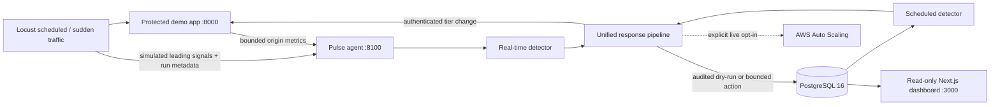

# Pulse

Pulse is a predictive traffic-surge control plane for a protected commerce workload. It combines
calendar-aware prewarming with real-time acceleration and leading-signal detection, sends both
modes through one audited response pipeline, safely models EC2 Auto Scaling changes, and sheds
only non-critical application work. `POST /checkout` remains normal at protection levels 0–3.

The default demonstration is complete and credential-free: PostgreSQL 16, the protected FastAPI
application, the Pulse FastAPI agent/workers, a live Next.js dashboard, two Locust scenarios, and
evidence export all run through Docker Compose with AWS execution fixed to `dry_run`. Terraform
and the boto3 adapter support an optional bounded AWS demonstration, but this repository never
enables live mutation implicitly.

## Architecture



Runtime boundaries are `agent/`, `demo_app/`, `common/`, `db/`, `load_tests/`, `dashboard/`, and
`infra/`. See [architecture](docs/architecture.md) and the executable
[state machine](docs/state-machine.md) for component and failure-flow details.

## Safety invariants

- `PULSE_EXECUTION_MODE=dry_run` is the source, Compose, and example default. Live mode also
  requires an AWS region and ASG name; standard AWS credential resolution stays outside source.
- Every capacity request is clamped twice to `min(global ceiling, event ceiling)` before boto3.
- One response pipeline and one Auto Scaling adapter handle scheduled and real-time commands.
- The scaling action is claimed durably before external work. Stable idempotency keys make
  repeated worker polls no-ops and uncertain actions block scale-in until reconciliation.
- Scale-down requires sustained low load, reduces capacity and tier stepwise, and honors cooldown.
- The demo app persists a tier transition before activation. Checkout bypasses every
  non-critical limiter/cache/disable policy.
- Predictions, applied/capped/no-op/dry-run/failed/skipped actions, and shedding intervals retain
  UTC timestamps, correlation, machine reason codes, human reasoning, and bounded signal evidence.

## Prerequisites

For the full local demonstration install Docker Engine with Compose v2. For local source checks,
use Python 3.11+ and Node.js 22 with pnpm 11.19.0. Terraform 1.6+ and AWS credentials are needed
only for an operator-authorized AWS plan/apply. No AWS account is needed for Compose or CI.

## Start the complete local stack

```bash
cp .env.example .env
# Change PULSE_CONTROL_TOKEN before any shared/non-local use.
docker compose config --quiet
docker compose up --build --wait
```

Open:

- dashboard: <http://localhost:3000>
- Pulse health and API: <http://localhost:8100/health>, <http://localhost:8100/docs>
- protected app health and API: <http://localhost:8000/health>, <http://localhost:8000/docs>

Compose waits for PostgreSQL, applies Alembic migrations, then health-gates the demo app, agent,
and dashboard. Confirm the dry-run boundary:

```bash
curl -fsS http://localhost:8100/api/v1/status
curl -i -X POST http://localhost:8000/checkout \
  -H 'Content-Type: application/json' \
  -d '{"cart_id":"readme-checkout","item_count":1}'
```

The status response must show `execution_mode: dry_run`; checkout returns
`X-Pulse-Endpoint-Mode: normal` and `X-Pulse-Protection: critical-never-shed`.

## Run the two surge demonstrations

Use the token in your uncommitted `.env`; the default below is for localhost only.

Scheduled Diwali prewarm (the wrapper idempotently seeds a relative event):

```bash
PULSE_PYTHON=.venv/bin/python load_tests/scripts/run_scheduled.sh \
  --control-token '<YOUR_LOCAL_TOKEN>' \
  --smoke
```

Unannounced acceleration spike:

```bash
PULSE_PYTHON=.venv/bin/python load_tests/scripts/run_sudden_spike.sh \
  --control-token '<YOUR_LOCAL_TOKEN>' \
  --smoke
```

For an equal-input reactive-only versus Pulse pair:

```bash
PULSE_PYTHON=.venv/bin/python load_tests/scripts/run_pair.sh \
  --scenario sudden-spike \
  --control-token '<YOUR_LOCAL_TOKEN>' \
  --smoke
```

Longer evidence runs omit `--smoke`. Every run records seed, endpoint weights, thresholds,
execution mode, timestamps, raw Locust summary, formula version, and record references. Generated
JSON/Markdown evidence is written to ignored `load_tests/results/`; use a completed run ID to
re-export it:

```bash
.venv/bin/python scripts/export_results.py --run-id '<RUN_UUID>'
```

See the exact lifecycle, reset, and failure commands in the [demo runbook](docs/demo-runbook.md).

## Configuration

`.env.example` documents the complete local surface. Important groups are:

| Group | Representative values | Safety behavior |
|---|---|---|
| execution | `PULSE_EXECUTION_MODE`, `AWS_REGION`, `PULSE_ASG_NAME` | dry-run default; live requires all explicit values |
| capacity | `PULSE_MAX_INSTANCE_CEILING`, `PULSE_MINIMUM_DESIRED_CAPACITY` | validated startup bounds and double clamp |
| detection | baseline/acceleration/ratio/confidence/confirmation settings | asymmetric entry/exit hysteresis |
| recovery | low threshold, confirmation count, cooldown, decrement | gradual, non-flapping scale-down |
| signals | poll, freshness, timeout, buffer, simulated TTL settings | bounded memory and graceful optional-provider loss |
| APIs | query window/row limits, dashboard origins | bounded read-only browser access |
| protection | `PULSE_CONTROL_TOKEN`, non-critical rate/burst | token is server-side; checkout never uses limiter |

Never commit `.env`, AWS credentials, private keys, Terraform state/plan, or generated run output.
The dashboard contains only read-only operator routes and never receives the control token.

## Local development and verification

```bash
python3.11 -m venv .venv
source .venv/bin/activate
python -m pip install -e '.[dev,load]'
python -m compileall -q common db demo_app agent load_tests scripts tests
ruff check .
pytest -q --cov=common --cov=db --cov=demo_app --cov=agent --cov-fail-under=85
pnpm --dir dashboard install --frozen-lockfile
pnpm --dir dashboard test
pnpm --dir dashboard build
python scripts/secret_scan.py
```

With Docker and Terraform installed, also run:

```bash
bash scripts/smoke_stack.sh
terraform -chdir=infra fmt -check -recursive
terraform -chdir=infra init -backend=false
terraform -chdir=infra validate
```

GitHub Actions repeats these checks, performs a live PostgreSQL 16
`base → head → base → head` migration cycle, builds all images, starts a clean stack, and runs both
bounded Locust workflows. CI receives no AWS credentials and never runs `terraform apply`.

## Optional bounded AWS demonstration

Terraform creates an IMDSv2-only encrypted launch template, an ASG with minimum/desired one and a
hard validated maximum of five (example maximum three), a no-action reactive-comparator alarm,
and the runtime role/policy. It reuses explicit existing network, security-group, and AMI inputs;
it does not create a VPC, NAT gateway, load balancer, database, queue, or DNS record.

```bash
cp infra/environments/demo.tfvars.example infra/environments/demo.auto.tfvars
terraform -chdir=infra fmt -check -recursive
terraform -chdir=infra init -backend=false
terraform -chdir=infra validate
terraform -chdir=infra plan \
  -var-file=environments/demo.auto.tfvars \
  -out=pulse-demo.tfplan
terraform -chdir=infra show pulse-demo.tfplan
```

Review the plan, IAM, regional quota, networking, and spend before an authorized apply. Applying
infrastructure still does not switch Pulse to live mode. Follow [infra/README.md](infra/README.md)
for explicit apply/destroy and verification. Runtime IAM scopes `SetDesiredCapacity` to the one
target ASG and optional SQS reads to one queue; unavoidable ASG/CloudWatch reads are documented.

## Results and portfolio claims

Pulse calculates results only from a persisted run. Required cards are checkout p99 and success
rate, detection lead time versus the reactive comparator, and provisioning efficiency. Prediction
error, over-provisioned instance-minutes, under-provisioned seconds, error rate, recovery duration,
and cost duration are available when their evidence exists. Missing or incomplete evidence remains
`not_available`; this README intentionally contains no invented improvement percentage.

Use [results-template](docs/results-template.md) to publish a run-ID-linked comparison and the
formulas it must reconcile. Until a real paired run is recorded, measured values are **not
available**.

## Reset, stop, and troubleshoot

Reset only generated runs/events and return the persisted tier to zero:

```bash
.venv/bin/python scripts/reset_demo.py \
  --control-token '<YOUR_LOCAL_TOKEN>' \
  --purge-generated
```

Inspect service state and stop without deleting PostgreSQL data:

```bash
docker compose ps
docker compose logs --tail=200 postgres migrate demo-app agent dashboard
docker compose down
```

Delete the named local demo volume only when its data is no longer needed:

```bash
docker compose down --volumes
```

Common fixes: check `migrate` logs for database readiness, confirm ports 8000/8100/3000 are free,
use the same uncommitted control token for the agent/app/load driver, and verify status still says
`dry_run`. A live-mode startup failure is intentionally fail-closed when region, ASG, credentials,
or safety bounds are missing. More cases are in the [demo runbook](docs/demo-runbook.md).

## Repository map

```text
agent/       Pulse API, collectors, detectors, scheduler, response/recovery, boto3 adapter
demo_app/    Protected commerce API, bounded metrics, authoritative tier controller
common/      Immutable contracts, enums, UTC/logging helpers
db/          SQLAlchemy models, async repositories, reversible Alembic migrations
load_tests/  Locust scenarios, deterministic plans, clients, evidence export
dashboard/   Read-only Next.js operator dashboard and Vitest suite
infra/       Bounded low-cost AWS Terraform and IAM rationale
scripts/     Seed/reset/export, clean-stack smoke, verification, secret scan
tests/       Unit, API, PostgreSQL integration, infrastructure, and e2e tests
docs/        Architecture, state machine, demo runbook, and results template
```

## Delivery status

The implementation is maintained on `complete-predictive-surge-platform`, based on
`codex/demo-app-foundation`. The delivery workflow opens an unmerged pull request after QA,
review, impact/flow validation, documentation sync, secret scanning, and green CI; it does not
deploy or merge automatically.
