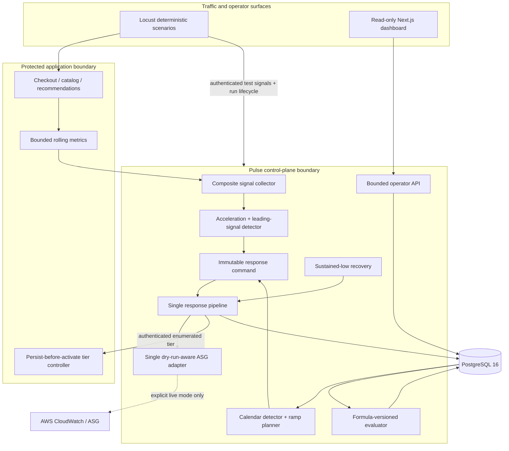
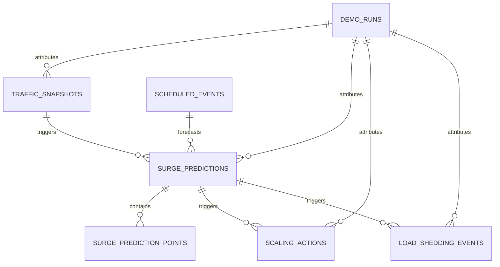

# Pulse architecture

## Runtime topology

## Ownership and dependency rules

| Boundary | Owns | Does not own |
|---|---|---|
| `demo_app` | protected request behavior, bounded request metrics, active endpoint policy | prediction, AWS, scheduling |
| `agent` | collection, detection, scheduling, response, recovery, feedback, operator API | commerce business behavior |
| `db` | schema, migrations, async repositories, query bounds | HTTP or provider policy |
| `common` | immutable contracts, enums, UTC and redaction helpers | service orchestration |
| `dashboard` | bounded credential-omitting GET polling and visualization | mutations or control token |
| `load_tests` | deterministic workload/signals, run lifecycle, evidence export | durable business state |
| `infra` | optional bounded AWS resources and runtime identity | application deployment automation |

The agent never imports the demo application's controller. It uses the authenticated HTTP control
boundary, so the application remains authoritative and persists an interval before changing its
in-memory policy. The browser never uses that boundary.

## Data and decision flow

1. The demo application records request count/rate, concurrency, latency percentiles, errors, and
   fixed-cardinality endpoint results without external I/O on the protected path.
2. The collector polls origin metrics and merges optional simulated or AWS-shaped edge, queue,
   session/login, and CPU readings. Missing optional sources reduce confidence; a missing origin
   causes a safe hold.
3. The real-time detector uses actual sample spacing, a moving/exponential baseline, first-order
   change, acceleration, ratio, leading agreement, freshness, confirmation, and hysteresis.
4. The scheduled worker validates UTC instants plus IANA timezone metadata and claims stable ramp
   points. Restart catch-up audits obsolete points and executes only the latest safe due target.
5. Both modes persist a prediction and create the same `ResponseCommand` with correlation,
   ceiling, tier request, evidence, reason, and recovery plan.
6. The pipeline claims the action, clamps capacity, uses the sole adapter, records the outcome,
   then applies any protection increase. Failed/unknown scale-in never lowers protection.
7. Recovery requires an exact low-load count and cooldown, decreases capacity by a bounded step,
   unwinds one tier at a time, and is interrupted by renewed high load.
8. The evaluator joins the run, snapshots, predictions, actions, and shedding intervals. It stores
   only defensible metrics and explicit warnings for missing evidence.

## Persistence model

Foreign keys preserve audit history with nullable references where deletion is allowed. Typed
columns support time-bounded graph/result queries; JSONB is reserved for bounded signal/config
evidence. Alembic revisions `20260818_0001` and `20260818_0002` both have downgrade paths.

## Failure boundaries

- Database failure before an action claim: no AWS or tier call.
- Provider success with outcome-write failure: state becomes failure-safe/unknown; reconciliation
  reads provider state and blocks scale-in meanwhile.
- Provider failure: audited; protection may increase, but cannot decrease.
- Tier-control failure: prior application policy stays active and the sanitized error is audited.
- Optional signal failure: visible provider health and lower confidence; origin processing continues.
- Agent failure: the protected app continues serving its last durable tier; checkout stays normal.

## Deployment boundaries

Compose is the mandatory acceptance environment and supplies no AWS credentials. Terraform is an
optional operator-controlled boundary: it provisions a launch template, bounded ASG, reactive
comparator alarm, and runtime identity against existing networking. CI builds and validates but
never applies. See [demo-runbook.md](demo-runbook.md) and
[`infra/README.md`](../infra/README.md).
