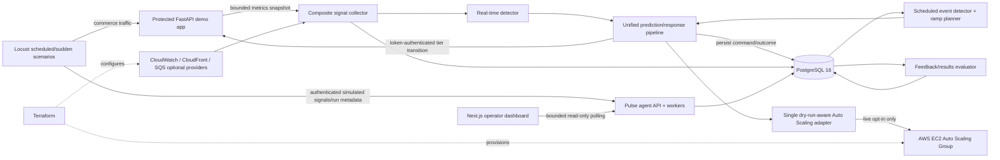
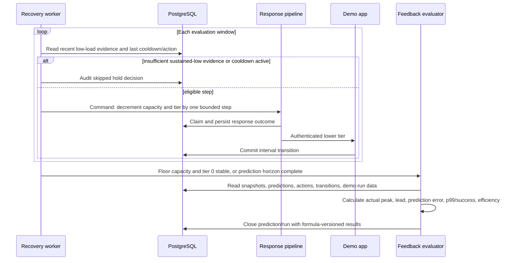

# Software Design Document

**Artifact slug:** `complete-predictive-surge-platform`  
**Workflow ID:** `daefa536-d064-42a8-aaef-98272b2b332e`  
**Title:** Complete Predictive Surge Platform  
**Version:** 1.0  
**Status:** PENDING_APPROVAL  
**RDD reference:** [complete-predictive-surge-platform-requirements.md](./complete-predictive-surge-platform-requirements.md)

## 1. System overview

Pulse will extend the current protected FastAPI commerce application and PostgreSQL schema into a complete, local-first predictive traffic-surge platform. It will continuously collect application and optional leading signals, identify scheduled ramps and unplanned acceleration, turn either detection mode into one safety-bounded response command, and use that command to pre-scale capacity and progressively reduce non-critical work. The critical checkout path remains normal at all protection levels. All predictions and response outcomes, including dry-run, capped, skipped, failed, and recovery decisions, are persisted with UTC timestamps, correlation, evidence, and human-readable reasoning.

The repository remains one modular monolith with separately runnable processes: the protected demo application, a Pulse control-plane API/worker, a Next.js operator dashboard, PostgreSQL, on-demand Locust drivers, and Terraform for an optional small AWS deployment. The mandatory acceptance path runs locally through Docker Compose without AWS credentials. The same control-plane boundary can read AWS metrics and call EC2 Auto Scaling when an operator explicitly enables live mode. Simple rolling statistics and exponential smoothing are replaceable forecasting strategies; no heavyweight machine-learning runtime is required for the complete v1 platform.

### 1.1 In scope

- All 22 Must functional requirements and all 15 non-functional requirements in the RDD.
- All ten ordered product deliverables: repository boundaries, database schema, explicit control flow/state machine, protected demo app, real-time detector, scheduled detector, Locust scenarios, dashboard, complete operations documentation, and defensible measured results.
- A single dry-run-aware Auto Scaling adapter, hard global/event ceilings, command idempotency, recovery hysteresis, cooldown, and gradual scale-down.
- Reproducible local scheduled and sudden-spike demonstrations with captured run metadata and calculated portfolio metrics.
- Minimal low-cost Terraform, GitHub Actions verification, feature-branch delivery, and an open unmerged pull request.

### 1.2 Out of scope

- Production multi-region control-plane consensus, leader election, enterprise SSO, or a production commerce product.
- Automatic production deployment or merging the pull request.
- Committing measured claims not produced by an actual recorded run.
- Mandatory live AWS apply/mutation in the default scope; the adapter and Terraform remain fully implemented and testable without account credentials.
- Prophet, LSTM, or other heavyweight forecasting dependencies in v1.

### 1.3 Requirements coverage

| FR/NFR ID | Design section | Notes |
|-----------|----------------|-------|
| FR-1 | 2, 3, 9.4 | Explicit agent, app, common, DB, load-test, dashboard, infrastructure, test, script, and documentation paths. |
| FR-2 | 5 | Existing six-table schema is retained and extended through a reversible second migration; a demo-run entity makes result claims reproducible. |
| FR-3 | 2.4, 6 | One shared state machine covers scheduled and real-time detection, protection, recovery, cooldown, and failure-safe behavior. |
| FR-4 | 3, 4.1 | Existing commerce and observability endpoints remain stable and are regression-tested. |
| FR-5 | 2.5, 3, 4.4 | Existing tier matrix and persist-before-activation controller are retained and integrated with Pulse. |
| FR-6 | 2.2, 3, 4.3, 4.15 | Composite signal collection tolerates absent optional providers and records freshness/health. |
| FR-7 | 2.3, 3, 5, 6.1 | Rolling baseline, delta, derivative/acceleration, confirmation, hysteresis, confidence, and reactive comparator are deterministic. |
| FR-8 | 2.4, 3, 5, 6 | Both modes emit the same typed response command and idempotency key; every outcome is audited. |
| FR-9 | 2.5, 3, 5, 6 | One boto3 adapter defaults to dry-run, clamps before invocation, and captures provider outcomes. |
| FR-10 | 2.3, 3, 5, 6.2 | UTC event polling and stable ramp-point keys execute due points once. |
| FR-11 | 2.4, 2.5, 6.3 | Sustained-low confirmation, scale-down steps, cooldown, and reversible tier unwinding. |
| FR-12 | 2.6, 3, 4.12–4.14, 5 | Feedback evaluator persists onset/peak/error/lead/provisioning measures. |
| FR-13 | 3, 6.4, 9 | Timed Diwali and unannounced-spike Locust scenarios include run/reset scripts. |
| FR-14 | 2.7, 3, 4.5–4.14 | Polling Next.js dashboard renders traffic, capacity, tier, audit, and forecast overlay. |
| FR-15 | 4.5–4.14 | All graph/history endpoints are read-only, indexed, paginated, and time-bounded. |
| FR-16 | 2.8, 9.4 | Compose health/dependency order is PostgreSQL → migration → app/agent → dashboard. |
| FR-17 | 2.9, 3, 9 | Terraform provides bounded ASG, launch template, metrics/alarm, inputs, outputs, and least-privilege IAM. |
| FR-18 | 9 | Unit, integration, contract, migration, adapter, and local end-to-end tests cover both modes. |
| FR-19 | 9.3 | GitHub Actions verifies Python, PostgreSQL migrations, dashboard, Compose, Terraform, coverage, and secrets. |
| FR-20 | 9.4, 10 | README and supporting docs replace slice wording with complete setup, diagrams, demos, results, troubleshooting, and cleanup. |
| FR-21 | 2.6, 4.13–4.14, 5 | Critical-path p99/success, lead time, and provisioning efficiency are mandatory; error/recovery/cost duration are optional measured outputs. |
| FR-22 | 9.5 | Implementation is committed/pushed on the artifact-slug branch based on `codex/demo-app-foundation`; PR remains open. |
| NFR-1 | 2.5, 3, 5, 9 | Dry-run defaults and ceiling enforcement exist at configuration, service, adapter, test, Compose, and documentation layers. |
| NFR-2 | 2.5, 3, 4.1, 9 | Checkout never consults the shedding limiter and is tested at levels 0–3 and in both e2e modes. |
| NFR-3 | 2.4, 5, 6.3, 9 | Stable unique keys, transaction claims, locks, confirmation windows, and cooldown protect repeat polls/concurrency. |
| NFR-4 | 2.4–2.6, 5, 9 | Durable command/action/transition records include correlation, reason codes, text reasoning, and evidence. |
| NFR-5 | 2.2, 2.7, 4, 5 | Request middleware performs bounded in-memory work; DB writes occur in the agent; dashboard reads use bounded indexed queries. |
| NFR-6 | 2.3, 5, 6.1 | Trigger evidence includes baseline, delta/acceleration, confirmations, optional leading signals, and comparator time. |
| NFR-7 | 2.10, 4, 9 | Constant-time control-token checks, secret-safe examples, ignore rules, and no browser-held mutation token. |
| NFR-8 | 2.9, 3, 9 | IAM is action/resource scoped where AWS permits; runtime performs no resource creation. |
| NFR-9 | 2, 3, 5 | Python 3.11+, typed protocols/DTOs, injected clocks/clients, async DB access, and UTC-aware datetimes. |
| NFR-10 | 3, 9 | Deterministic clocks/providers and at least 85% Python coverage plus frontend/infrastructure checks. |
| NFR-11 | 4.2, 4.5, 9 | Health and status identify DB, sources, worker state, mode, capacity, cooldown, and tier without secrets. |
| NFR-12 | 2.2, 2.8, 6.4, 9 | Local providers and Compose require no AWS credentials; optional signals are explicitly absent/simulated. |
| NFR-13 | 5, 9 | Reversible migrations, timezone-aware columns, audit-preserving FKs, typed graph/result fields, and migration tests. |
| NFR-14 | 2.2–2.7, 4, 5 | All intervals/windows/thresholds/ratios are configured and all histories are bounded. |
| NFR-15 | 2.6, 4.13–4.16, 5, 9 | Demo-run records preserve scenario, thresholds, mode, baseline definition, formulas, timestamps, and generated summaries. |

## 1b. Scope options (user selects at SDD approval)

**Scope (choose one — default: Option 1):**

- (x) **Option 1 — Complete local-first A-to-Z platform** — includes every Must FR/NFR and all ten deliverables: both detectors, unified response/recovery, protected app, full persistence and evaluation, two reproducible Locust modes, live dashboard, Compose, tested boto3 adapter, minimal Terraform, CI, complete docs/results workflow, push, and open PR. Live AWS resources are not applied and no live capacity mutation is performed without account inputs; advanced forecasting is limited to the replaceable simple-statistics/exponential-smoothing boundary.
- ( ) **Option 2 — Complete platform plus live AWS evidence** — includes Option 1 and, after the user supplies/authorizes region, networking, credentials, instance type, ceiling, and spend, applies the low-cost Terraform stack, executes one bounded live scaling demonstration, records provider request IDs/metrics, and destroys the stack. Excludes production hardening, multi-region operation, and advanced forecasting experiments.
- ( ) **Option 3 — Complete platform plus live AWS and forecasting comparison** — includes Option 2 and adds a lightweight Holt-Winters/exponential-smoothing model comparison, model-selection evidence, dashboard comparison view, and measured model-quality tests. Excludes heavyweight Prophet/LSTM dependencies and production multi-region operation.

**Cleanup (optional — check to include):**

- [ ] **Remove unused files and dead code** in the affected area (beyond mandatory remove-on-touch cleanup; superseded files, orphaned tests, and stale configuration are deleted).

> Selecting Option 1 does not defer any requested platform deliverable. Options 2 and 3 require external AWS state or add forecasting experiments beyond the complete v1 acceptance path.

## 2. Architecture

### 2.1 Logical architecture

Pulse uses one repository and shared database but separates runtime responsibilities. The protected demo app owns request behavior, in-process rolling metrics, and the authoritative shedding controller. The agent owns collection, detection, scheduling, forecasting, response decisions, AWS integration, recovery, feedback evaluation, and read-only operator APIs. Both use shared typed contracts and repositories but do not import each other's business services. The agent changes application protection only through the authenticated internal HTTP API, preserving the application's persist-before-activate invariant.

The worker runs as a single active process per environment in v1. Within it, independent bounded loops collect/evaluate real-time signals, claim scheduled ramp points, evaluate recovery, and close completed predictions/runs. A common injected clock makes timed decisions deterministic in tests. A PostgreSQL unique idempotency key on scaling actions and transactional claims protect repeated polling. Runtime configuration validates safety bounds at startup, and every mutation path delegates to the same response pipeline and one capacity adapter.



### 2.2 Signal collection and persistence

`SignalProvider` is a typed async protocol returning `SignalReading(value, observed_at, freshness, status, details)`. Implementations cover the demo app snapshot over `httpx`, CloudWatch origin/CPU metrics, CloudFront request rate through CloudWatch, SQS depth/growth, and an in-memory bounded simulated-signal provider populated through an authenticated internal API. The collector treats origin metrics as required for real-time evaluation and all leading providers as optional. Timeouts, stale readings, and unavailable providers reduce confidence and appear in `signal_details`; they do not stop the worker (FR-6, R-4).

The collector keeps only enough in-memory samples for the configured window and persists every evaluated aggregate as `traffic_snapshots`. Endpoint metrics include checkout p99 and success rate. PostgreSQL history supplies restart continuity and dashboard data. Collection uses a short timeout and no protected request performs database or external-provider I/O (NFR-5, NFR-14).

### 2.3 Detection and forecasting

The real-time evaluator reads a fixed, time-ordered window and computes:

- baseline request rate: mean or exponentially smoothed rate over the baseline window;
- request-rate delta: current rate minus the preceding rate;
- normalized acceleration: delta divided by elapsed seconds;
- current-to-baseline and edge-to-origin ratios;
- queue, session, and login growth when fresh;
- confidence: a configured weighted score from acceleration confirmation, sustained ratio, leading-signal agreement, sample sufficiency, and freshness;
- reactive comparator state: the first timestamp at which CPU or configured raw-load threshold crosses its limit.

A trigger requires minimum sample count, acceleration/ratio threshold, configured consecutive confirmations, and minimum confidence. Exit thresholds are lower than entry thresholds. Strategy interfaces allow a deterministic moving-average/derivative implementation and an optional exponential-smoothing implementation without coupling the response pipeline to a forecasting package (FR-7, NFR-6).

The scheduled evaluator queries active events whose prewarm/recovery horizon intersects `now`. `RampPlanner` validates timezone-aware event data, ceiling, and monotonically increasing pre-start capacity points. It either uses the stored profile or derives linear steps from minimum to peak between `starts_at - prewarm_lead_seconds` and `starts_at - peak_lead_seconds`. Each due point has the stable key `scheduled:{event_id}:{offset_seconds}:{desired_capacity}` and is submitted exactly once. Post-event recovery uses the shared sustained-low/cooldown path rather than an unconditional drop (FR-10, FR-11).

### 2.4 Shared state machine and command contract

Both detectors emit a `SurgePredictionCandidate`; `PredictionService` persists it and produces the same immutable `ResponseCommand`:

```text
command_id / idempotency_key
correlation_id and optional demo_run_id
prediction_id, trigger_snapshot_id, scheduled_event_id
mode and target_resource
requested_desired_capacity and maximum_ceiling
optional requested_shedding_level
reason_code, reasoning, signal_evidence
recovery_plan {low_threshold, confirmation_count, cooldown_seconds, decrement_step, floor}
```

| State | Entry | Permitted actions | Exit |
|-------|-------|-------------------|------|
| `NORMAL` | Startup or completed cooldown | Collect/persist; no protection mutation | Confirmed real-time evidence → `WATCH`; scheduled horizon → `PREWARM`; persistence/provider fault → `FAILURE_SAFE` |
| `WATCH` | First qualifying real-time evidence | Persist prediction candidate; wait for confirmations | Confirmed confidence → `PROTECT`; evidence falls below exit threshold → `NORMAL` |
| `PREWARM` | A scheduled ramp horizon opens | Claim/execute due capacity points; optionally tier 1 immediately before event | Event/surge threshold → `PROTECT`; cancelled event with low load → `RECOVERY` |
| `PROTECT` | Confirmed surge or event peak window | Scale out up to ceiling; set tier appropriate to pressure | Sustained low evidence after event/peak → `RECOVERY`; fault → `FAILURE_SAFE` |
| `RECOVERY` | Low-load confirmation count met | Lower tier one step and capacity by bounded decrement | Remaining protection/capacity → `COOLDOWN`; floor and tier 0 → `NORMAL` |
| `COOLDOWN` | Any scale/tier reduction | Continue observing/auditing; reject reverse or repeated reductions except emergency scale-out | Timer expires → prior target state; renewed high evidence → `PROTECT` |
| `FAILURE_SAFE` | DB unavailable, invalid config, app control failure, or provider failure | No unaudited AWS/tier mutation; preserve current tier; report degraded health; bounded retry | Dependencies recover → reconcile then `WATCH`/`PROTECT`/`RECOVERY` based on evidence |

### 2.5 Response safety and ordering

For each command, `ResponsePipeline` performs the following order (FR-8, FR-9, NFR-1, NFR-4):

1. Validate UTC timestamps, target, requested capacity, recovery plan, and tier; derive the effective ceiling as `min(global_ceiling, event_override when present)`.
2. Clamp requested capacity before calling any adapter. Construct a stable idempotency key and transactionally insert the planned scaling action. A unique-key conflict returns the existing result without a provider call.
3. In dry-run, read simulated/current capacity if available, record `dry_run`, `noop`, or `capped`, and never call `set_desired_capacity`.
4. In live mode, call only the injected `AutoScalingCapacityAdapter`. The adapter checks the ceiling again, calls `DescribeAutoScalingGroups` and then `SetDesiredCapacity`, and returns the provider request ID/error. The pre-existing planned row is updated to `succeeded`, `failed`, `capped`, or `skipped`; a reconciliation worker resolves a rare post-provider DB update failure from the planned record and provider state.
5. Apply any tier change through the demo app's token-authenticated endpoint. The demo app commits the new interval before switching its in-memory policy. A failure leaves the previous policy active and is reported on status; emergency protection can be retried with the same correlation.
6. Store cooldown/recovery state. Scale-out may interrupt recovery when new high evidence appears; scale-in and tier reductions cannot bypass the low-evidence and cooldown guards.

Checkout is structurally excluded from the policy matrix and from the token bucket. The response pipeline can request only an enumerated tier, never endpoint-level overrides (NFR-2).

### 2.6 Feedback loop and result formulas

`FeedbackEvaluator` closes a prediction after its configured horizon and closes a demo run when the load wrapper reports completion. It joins typed prediction points and traffic snapshots by `demo_run_id`, environment, and time range. It stores raw parameters plus the calculated summary; an API response always discloses the observation interval, scenario, execution mode, threshold snapshot, and formula version.

Mandatory metrics (FR-12, FR-21):

- **Critical checkout p99**: percentile of checkout request latencies recorded by the demo app for the run; **checkout success rate** = successful checkout responses / checkout attempts.
- **Detection lead time** = `reactive_comparator_crossed_at - prediction.created_at`; negative/absent comparator cases are labeled, not coerced into a positive claim.
- **Provisioning efficiency** = required instance-minutes / provisioned instance-minutes × 100, where required instances at each snapshot are `ceil(actual_rps / configured_capacity_per_instance)` and provisioned instances use audited desired capacity. Division-by-zero yields `not_available`.
- **Prediction error** = `abs(predicted_peak_rps - actual_peak_rps) / max(actual_peak_rps, epsilon) × 100`.
- **Over-provisioned instance-minutes** = time integral of `max(provisioned - required, 0)`; **under-provisioned seconds** integrates intervals where required exceeds provisioned.
- Optional displayed metrics: error-rate reduction relative to the paired reactive-only run and recovery/cost duration from peak until floor capacity/tier 0.

No percentage improvement is committed in documentation unless both compared runs exist and are referenced by IDs (NFR-15, R-7).

### 2.7 Dashboard

The dashboard is a small Next.js/React application using a lightweight chart library and browser polling. A single configurable refresh interval (default 2 seconds, minimum 1 second) fetches `/status` and time-bounded history in parallel, cancels stale requests, and retains only the visible window. Views include current detector/state/provider health; traffic and checkout p99; actual versus predicted RPS; desired/in-service/pending capacity; tier and endpoint policy; scheduled-event/ramp state; recent actions with evidence/reasoning; and run results. The browser receives no control token and exposes no mutation UI (FR-14, R-8).

### 2.8 Local deployment

Compose defines `postgres`, one-shot `migrate`, `demo-app`, `agent`, and `dashboard`. PostgreSQL readiness gates migration; successful migration and demo app health gate the agent; agent health gates dashboard startup. Defaults use dry-run and simulated optional providers. Containers have explicit health checks, restart policies for long-running services, bounded logs, and named database storage. Locust remains an on-demand profile or documented host command so `docker compose up --build` starts a usable platform without immediately generating traffic (FR-16, NFR-12).

### 2.9 AWS deployment boundary

Terraform provides a launch template with IMDSv2, configurable AMI/instance type/user data, an ASG with desired/minimum one and a conservative configurable maximum, supplied VPC/subnet/security-group inputs, a `Pulse/Traffic` custom metric namespace/alarm representing the reactive comparator, and a Pulse IAM policy/role. An optional load-balancer module may be enabled for a live demo but remains off in the lowest-cost defaults. Outputs include ASG name/ARN, alarm name, role/policy ARN, and any enabled endpoint. CI runs format/init/validate only and never applies.

IAM permits only required reads/publishing and `autoscaling:SetDesiredCapacity` scoped to the configured ASG ARN; APIs such as `DescribeAutoScalingGroups` and CloudWatch reads that do not support resource scoping use `Resource: *` with documented conditions where supported. SQS queue reads are scoped to an optional queue ARN. The runtime cannot create, delete, or reconfigure arbitrary AWS resources (FR-17, NFR-8, R-9).

### 2.10 Security and secret handling

Internal signal/run and shedding mutation routes use `X-Pulse-Control-Token` and `secrets.compare_digest`. Read-only demo/status APIs are unauthenticated for the local portfolio environment; AWS security-group and bind-address inputs restrict their exposure in live demos. CORS permits only configured dashboard origins. Logs and APIs omit credentials/token values. `.gitignore` excludes `.env`, Terraform state/plan files, generated load results, Node build directories, and credential artifacts. Examples contain placeholders/local-only values and use environment/default AWS credential resolution (NFR-7).

## 3. Components

| Component | Responsibility | Repo | New/Modified | FR/NFR |
|-----------|----------------|------|--------------|--------|
| `common.contracts` / enums | Typed signal, prediction, response, recovery, status, and policy contracts without service imports | `Suryavarma333/pulse-engine` | Create/modify | FR-1, FR-8, NFR-9 |
| `demo_app.app.metrics` | Bounded rolling aggregate and endpoint-specific request metrics with no blocking external I/O | Same | Modify | FR-4, FR-6, FR-21, NFR-5 |
| Protected routes/policy/limiter | Preserve commerce behavior and enforce immutable checkout protection across tiers | Same | Modify only as integration requires | FR-4, FR-5, NFR-2 |
| Demo operations router/controller/store | Health/snapshot contracts and authenticated persist-before-activate transitions | Same | Modify | FR-5, FR-6, NFR-4, NFR-7 |
| `db.models` and repositories | Async CRUD, bounded history, transaction claims, and audit/evaluation persistence | Same | Create/modify | FR-2, FR-8, FR-10, FR-12, NFR-13 |
| `agent.app.config` | Validate windows, thresholds, URLs, token, dry-run, target, ceilings, cooldown, and provider configuration | Same | Create | FR-7–FR-11, NFR-1, NFR-14 |
| Composite metric providers | Demo, simulated, CloudWatch/CloudFront, SQS, and session/login signal collection with freshness/health | Same | Create | FR-6, NFR-6, NFR-12 |
| Real-time detector | Baseline/delta/acceleration/confidence, confirmation/hysteresis, comparator timestamp | Same | Create | FR-7, NFR-3, NFR-6 |
| Scheduled detector/ramp planner | Timezone-aware due-event polling, monotonic ramp calculation, exact-once point keys | Same | Create | FR-10, NFR-3 |
| Prediction/forecast service | Persist prediction/points and create shared command independent of detector mode | Same | Create | FR-3, FR-8, NFR-4 |
| Response state machine/pipeline | Validate, claim idempotency, coordinate capacity, tier, cooldown, and failure-safe state | Same | Create | FR-3, FR-8, FR-11, NFR-1–NFR-4 |
| Auto Scaling adapter | Dry-run simulation, live boto3 reads/mutation, second ceiling check, provider metadata | Same | Create | FR-9, NFR-1, NFR-8 |
| Shedding HTTP client | Token-authenticated calls, timeout, retry classification, and status reconciliation | Same | Create | FR-5, FR-8, NFR-7 |
| Feedback/results evaluator | Close predictions/runs and calculate traceable portfolio metrics | Same | Create | FR-12, FR-21, NFR-15 |
| Agent API and worker lifespan | Start bounded loops; expose health, status, history, internal simulation, and run lifecycle | Same | Create | FR-6, FR-10, FR-15, NFR-11 |
| Locust scenarios/wrappers | Scheduled Diwali and unexpected spike workloads, run registration, evidence export, reset | Same | Create | FR-13, FR-21, NFR-15 |
| Next.js dashboard | Live read-only operational and predicted-versus-actual views | Same | Create | FR-14, NFR-5, NFR-14 |
| Docker/Compose images | Reproducible dependency-safe local stack and on-demand load profile | Same | Create/modify | FR-16, NFR-12 |
| Terraform modules/root | Low-cost launch template, bounded ASG, metric/alarm, IAM, variables/outputs | Same | Create | FR-17, NFR-1, NFR-8 |
| GitHub Actions | Backend, migration, frontend, Compose, Terraform, coverage, and secret checks | Same | Create | FR-19, NFR-7, NFR-10 |
| Docs/scripts | Seed/reset, exact demos, architecture/state diagrams, IAM/AWS setup, results formulas | Same | Create/modify | FR-20–FR-22, NFR-15 |

## 4. APIs

All timestamps use RFC 3339 UTC. List responses use `{items, next_cursor, from, to}`; `from` and `to` are required or default to a configured bounded window, `limit` defaults to 200 and is capped at 1,000. UUIDs are canonical strings. Error bodies use `{detail, code, correlation_id?}`. The 16 endpoints marked **new** or **changed** below comprise the handoff API count.

### 4.1 Preserved commerce contracts (unchanged; not counted)

- `POST /checkout`: unauthenticated; validates `{cart_id, item_count}`; always returns normal endpoint mode and never 429 due to Pulse.
- `GET /recommendations`: unauthenticated; normal, disabled/minimal, or emergency-rate-limited according to the tier.
- `GET /catalog`: unauthenticated; normal, stale-cached, or emergency-rate-limited according to the tier.
- Validation returns HTTP 422. These contracts receive regression/e2e coverage but no incompatible schema change.

### 4.2 Demo application health — changed

- **Method / Path:** `GET /health`
- **Auth:** none locally; network-restricted in AWS.
- **Request:** none.
- **Response:** `200` with service/environment, readiness, DB persistence status, tier/event/reason, endpoint policy, bounded metric summary, and `critical_path_protected: true`; `503` when the database-backed controller cannot be initialized.
- **Errors:** HTTP 503 `DEPENDENCY_UNAVAILABLE`; no secrets or control token are returned.
- **Idempotency / rate limit:** safe read; excluded from traffic metrics and bounded by deployment-level limits.

### 4.3 Demo application traffic snapshot — changed

- **Method / Path:** `GET /metrics/snapshot`
- **Auth:** none on the internal Compose network; network-restricted in AWS.
- **Request:** optional `run_id` is not accepted from the public caller; current run association comes from agent collection context.
- **Response:** observed/window timestamps, origin RPS, request count, concurrent requests, aggregate percentiles/error rate, per-endpoint counts/p99/success, current tier/policy.
- **Errors:** HTTP 500 `METRIC_SNAPSHOT_FAILED` only for internal invariant failure.
- **Idempotency / rate limit:** safe read; response work is O(samples in configured bounded window).

### 4.4 Demo application tier control — changed

- **Method / Path:** `POST /internal/load-shedding`
- **Auth:** required `X-Pulse-Control-Token`, compared in constant time.
- **Request:** `{level: 0..3, reason_code, reasoning, changed_by, signal_evidence, correlation_id?, prediction_id?, trigger_snapshot_id?, demo_run_id?}`.
- **Response:** `200` `{changed, event_id, level, level_name, started_at, reason_code, reasoning, endpoint_policies}`. Same-level commands return `changed:false` without another interval.
- **Errors:** HTTP 401 `INVALID_CONTROL_TOKEN`; 422 validation; 409 `TRANSITION_CONFLICT`; 503 `AUDIT_PERSISTENCE_UNAVAILABLE`. A persistence error leaves the in-memory tier unchanged.
- **Idempotency / rate limit:** serialized by the controller; duplicate level is a no-op; agent retries only timeout/503 with the same correlation.

### 4.5 Agent health — new

- **Method / Path:** `GET /health`
- **Auth:** none locally; network-restricted in AWS.
- **Request:** none.
- **Response:** `200` when process is live; `status` is `ok` or `degraded`, and dependency fields summarize PostgreSQL, demo app, collectors, and worker heartbeat. `503` is returned only when mandatory DB initialization/worker startup is unavailable.
- **Errors:** HTTP 503 `NOT_READY`.
- **Idempotency / rate limit:** safe constant/bounded read; suitable for Compose health checks.

### 4.6 Agent operational status — new

- **Method / Path:** `GET /api/v1/status`
- **Auth:** none locally; configured CORS/network restriction.
- **Request:** optional `environment`.
- **Response:** execution mode, global/event ceiling, state machine state, latest evaluated snapshot/prediction, current/desired/in-service/pending capacity, tier/policy, cooldown/recovery progress, scheduled next point, provider freshness/health, worker heartbeats, and DB/demo readiness.
- **Errors:** 422 invalid environment; 503 mandatory dependency unavailable. Partial optional provider failures remain `200` with explicit status.
- **Idempotency / rate limit:** safe read; assembled from bounded latest-row queries and cached provider health.

### 4.7 Traffic snapshot history — new

- **Method / Path:** `GET /api/v1/snapshots`
- **Auth:** none locally.
- **Request:** `environment`, bounded `from`/`to`, `limit`, `cursor`, optional `demo_run_id`.
- **Response:** typed rates/delta/acceleration, optional signals, checkout/aggregate latency and success, capacity, tier, comparator flag, freshness/evidence summary.
- **Errors:** 422 invalid/unbounded range or limit; 500 query error.
- **Idempotency / rate limit:** safe read; `(environment, observed_at)` and run/time indexes; maximum range/rows enforced.

### 4.8 Prediction list — new

- **Method / Path:** `GET /api/v1/predictions`
- **Auth:** none locally.
- **Request:** bounded time range plus optional `mode`, `status`, `environment`, `demo_run_id`, `limit`, `cursor`.
- **Response:** prediction summaries with trigger, start/peak/end, baseline/peak/multiplier, confidence, capacity, status, actual/evaluation metrics, and reasoning.
- **Errors:** 422 invalid enum/range; 500 query error.
- **Idempotency / rate limit:** safe indexed/paginated read.

### 4.9 Prediction detail and overlay — new

- **Method / Path:** `GET /api/v1/predictions/{prediction_id}`
- **Auth:** none locally.
- **Request:** UUID path; optional bounded `include_actual_window_seconds` capped by configuration.
- **Response:** full prediction, evidence, predicted points, associated actions/transitions, and time-aligned actual snapshot series for chart overlay.
- **Errors:** 404 `PREDICTION_NOT_FOUND`; 422 invalid UUID/window; 500 query error.
- **Idempotency / rate limit:** safe bounded read.

### 4.10 Scaling-action history — new

- **Method / Path:** `GET /api/v1/scaling-actions`
- **Auth:** none locally.
- **Request:** bounded time range plus optional `status`, `execution_mode`, `correlation_id`, `prediction_id`, `demo_run_id`, `limit`, `cursor`.
- **Response:** requested/applied/current capacity, ceiling, dry-run/live, status, cooldown, reason/evidence, provider request ID, and sanitized error.
- **Errors:** 422 invalid filter/range; 500 query error.
- **Idempotency / rate limit:** safe indexed/paginated read.

### 4.11 Load-shedding history — new

- **Method / Path:** `GET /api/v1/load-shedding-events`
- **Auth:** none locally.
- **Request:** bounded time range plus optional `environment`, `correlation_id`, `prediction_id`, `demo_run_id`, `active_only`, `limit`, `cursor`.
- **Response:** interval, from/to level, actor, reason/evidence, policy snapshot, and application status/error.
- **Errors:** 422 invalid filter/range; 500 query error.
- **Idempotency / rate limit:** safe indexed/paginated read.

### 4.12 Scheduled-event list — new

- **Method / Path:** `GET /api/v1/scheduled-events`
- **Auth:** none locally.
- **Request:** bounded `from`/`to`, optional `status`, `limit`, `cursor`.
- **Response:** event identity, UTC start/end plus IANA timezone, multiplier, ramp settings/profile, capacity bounds, confidence/source/status, next due point, and completed point count.
- **Errors:** 422 invalid range/filter; 500 query error.
- **Idempotency / rate limit:** safe indexed/paginated read. Events are created by the seed script in v1.

### 4.13 Results summary — new

- **Method / Path:** `GET /api/v1/results/summary`
- **Auth:** none locally.
- **Request:** bounded `from`/`to`, optional `environment`, `scenario`, `execution_mode`, `limit`, `cursor`.
- **Response:** completed-run cards containing critical p99/success, lead time, provisioning efficiency, prediction error, over/under-provisioning, error rate, recovery/cost duration, formula version, and comparability warnings.
- **Errors:** 422 invalid/unbounded filters; 500 query error.
- **Idempotency / rate limit:** safe indexed/paginated read; metrics are read from closed run summaries rather than recomputed on every dashboard poll.

### 4.14 Result run detail — new

- **Method / Path:** `GET /api/v1/results/runs/{run_id}`
- **Auth:** none locally.
- **Request:** UUID path.
- **Response:** run scenario/configuration/thresholds/timestamps/baseline definition, persisted metrics, referenced prediction/action IDs, chart time bounds, formula definitions, and status/warnings.
- **Errors:** 404 `RUN_NOT_FOUND`; 409 `RUN_NOT_COMPLETE` only when `require_complete=true`; 422 invalid UUID; 500 query error.
- **Idempotency / rate limit:** safe bounded read.

### 4.15 Simulated leading signals — new

- **Method / Path:** `POST /internal/signals/simulated`
- **Auth:** required `X-Pulse-Control-Token`, constant-time comparison.
- **Request:** `{observed_at, demo_run_id?, ttl_seconds, edge_request_rate_rps?, queue_depth?, concurrent_sessions?, login_rate_rps?, cpu_utilization_pct?, source}`; at least one signal is required and ranges are validated.
- **Response:** `202` with accepted fields, expiry, and provider status; values are consumed by the next collector poll and persisted in snapshot evidence.
- **Errors:** 401 invalid token; 422 invalid timestamp/range/empty signal; 429 bounded-buffer limit; 503 worker unavailable.
- **Idempotency / rate limit:** idempotency is `(source, observed_at, demo_run_id)` within the TTL; bounded buffer and configured request rate.

### 4.16 Demo-run start — new

- **Method / Path:** `POST /internal/demo-runs`
- **Auth:** required `X-Pulse-Control-Token`.
- **Request:** `{scenario_name, mode, environment, baseline_type, execution_mode, configuration, thresholds, started_at?, idempotency_key}`.
- **Response:** `201` new or `200` existing `{id, status, started_at}`.
- **Errors:** 401 invalid token; 409 conflicting idempotency payload; 422 invalid configuration; 503 persistence unavailable.
- **Idempotency / rate limit:** unique client idempotency key; only one active run per environment/scenario runner unless `allow_parallel` is explicitly enabled for tests.

### 4.17 Demo-run completion — new

- **Method / Path:** `PATCH /internal/demo-runs/{run_id}`
- **Auth:** required `X-Pulse-Control-Token`.
- **Request:** `{status: completed|failed|cancelled, ended_at, locust_summary, notes?}`; generated raw files are referenced by safe relative name only, never uploaded secrets.
- **Response:** `200` closed run with calculated metrics or explicit `pending_evaluation` until the feedback horizon ends.
- **Errors:** 401 invalid token; 404 run missing; 409 already closed/conflicting completion; 422 invalid time/status; 503 persistence/evaluation unavailable.
- **Idempotency / rate limit:** repeat of the same terminal payload returns the existing result; conflicting terminal state returns 409.

## 5. Data model

### 5.1 Entities

| Entity | Store | New/Modified | Key fields | Indexes / integrity | FR |
|--------|-------|--------------|------------|---------------------|----|
| `traffic_snapshots` | PostgreSQL | Modified | Existing signals/capacity/tier plus `demo_run_id`, `request_count`, `concurrent_requests`, `request_rate_change_rps`, `checkout_p99_latency_ms`, `checkout_success_rate`, `reactive_comparator_crossed` | Existing unique environment/time; `(demo_run_id, observed_at)`; value/range checks | FR-2, FR-6, FR-7, FR-12, FR-21 |
| `scheduled_events` | PostgreSQL | Retained/validated | UTC start/end, IANA timezone, multiplier, lead times, ramp profile, minimum/peak/event ceiling, status | `(status, starts_at)`; time/capacity/ceiling checks | FR-2, FR-10 |
| `surge_predictions` | PostgreSQL | Modified | Existing forecast/evaluation fields plus `demo_run_id`, `environment`, `correlation_id`, `reactive_comparator_crossed_at`, `formula_version` | mode/status/time and `(demo_run_id, created_at)`; confidence/rate checks | FR-2, FR-7, FR-8, FR-12 |
| `surge_prediction_points` | PostgreSQL | Retained | prediction/time, predicted RPS/capacity | composite PK `(prediction_id, point_at)` | FR-2, FR-14 |
| `scaling_actions` | PostgreSQL | Modified | Existing correlation/idempotency/capacity/ceiling/status/provider fields plus `demo_run_id` and `reconciled_at` | unique idempotency key; correlation/time/run indexes; applied ≤ ceiling | FR-2, FR-8, FR-9, FR-11 |
| `load_shedding_events` | PostgreSQL | Modified | Existing interval/policy/audit fields plus `demo_run_id` | one open interval/environment; time/run/correlation indexes | FR-2, FR-5, FR-11 |
| `demo_runs` | PostgreSQL | New | UUID, unique idempotency key, scenario/mode/environment/baseline/execution mode, configuration/threshold JSONB, start/end/status, comparator time, typed checkout/lead/provisioning/error/recovery/cost metrics, formula version, summary JSONB | `(environment, started_at)`, `(scenario_name, status)`; valid time/rates/status; partial active-run constraint | FR-12, FR-13, FR-21, NFR-15 |

`demo_run_id` foreign keys use `ON DELETE SET NULL` so operational audit survives intentional test-run cleanup. Prediction points cascade only with their prediction. Scheduled-event, prediction, and snapshot records otherwise preserve history. All persisted datetimes are timezone-aware; the application normalizes them to UTC while retaining the event's IANA timezone string.

### 5.2 Repository and transaction design

- `SnapshotRepository` bulk-inserts one evaluated row and serves bounded time/run queries.
- `ScheduledEventRepository` locks/reads due events. Ramp exact-once behavior is represented by the scaling-action idempotency row rather than a second mutable scheduler ledger.
- `PredictionRepository` commits prediction and points in one transaction and updates evaluation fields atomically.
- `ScalingActionRepository.claim(idempotency_key, planned_action)` uses insert-on-conflict/read-existing semantics; provider work never occurs unless claim persistence succeeds.
- `LoadSheddingStore` retains its row lock, interval close, and new interval insert in one transaction.
- `DemoRunRepository` provides idempotent start/terminal transition and persists formula/versioned results.

Every repository accepts an async session factory; service tests inject fakes and integration tests use PostgreSQL. No route manipulates ORM entities directly (NFR-9).

### 5.3 Migration approach

The existing `20260818_0001_initial_schema.py` remains the baseline. A new reversible `20260818_0002_control_plane_extensions.py` creates `demo_runs`, adds nullable run/evaluation columns and indexes, then adds foreign keys after the new table exists. Upgrade supplies safe defaults only for non-null new fields; downgrade drops new FKs/indexes/columns and then `demo_runs`, returning exactly to revision 0001. CI tests `base → head → base → head` against PostgreSQL 16 and compares SQLAlchemy metadata at head. SQLite is not treated as migration proof because JSONB, partial indexes, and locking are PostgreSQL-specific (FR-2, NFR-13).

### 5.4 Retention and bounded data

Default retention is configurable: raw snapshots 7 days locally, audit/prediction/run records retained until explicit operator cleanup, simulated readings only until TTL, and dashboard queries at most 24 hours/1,000 rows per request. A maintenance script deletes expired snapshots in small transactions and never cascades away audit records. Browser memory holds only the configured visible window (NFR-14).

### 5.5 Sensitive data

No entity stores credentials, request bodies, shopper PII, cart content, or control tokens. `cart_id` and `user_id` are not placed in metrics. Evidence is limited to aggregate numeric signals, provider status, thresholds, and sanitized AWS error metadata. Provider request IDs are operational identifiers, not credentials (NFR-7).

## 6. Sequence flows

### 6.1 Unannounced real-time surge

```mermaid
sequenceDiagram
  participant L as Locust sudden spike
  participant D as Protected demo app
  participant W as Real-time worker
  participant P as PostgreSQL
  participant R as Response pipeline
  participant A as Auto Scaling adapter

  L->>D: Checkout/catalog/recommendation traffic
  L->>W: Authenticated optional simulated edge/queue/CPU signals
  loop Configured poll interval
    W->>D: GET /metrics/snapshot
    W->>W: Merge fresh providers; compute baseline, delta, acceleration, confidence
    W->>P: Persist traffic snapshot
    alt confirmation threshold reached
      W->>P: Persist prediction and forecast points
      W->>R: ResponseCommand with stable idempotency key
      R->>P: Claim planned scaling action
      alt dry-run (default)
        R->>A: Read/simulate capacity only
        A-->>R: dry-run applied capacity
      else explicit live mode
        R->>A: Set desired capacity after second clamp
        A-->>R: provider request ID or error
      end
      R->>P: Persist action outcome and cooldown
      R->>D: POST /internal/load-shedding with token and correlation
      D->>P: Close/open interval in transaction
      P-->>D: Commit
      D-->>R: Applied tier/policy
    end
  end
```

If the DB insert/claim fails, the response pipeline makes no AWS or tier call. If an optional signal is stale, it is excluded and confidence reflects its absence. If AWS live scaling fails, the action becomes failed and the tier can still increase to protect checkout, using the same correlation (R-3, R-4, R-5).

### 6.2 Scheduled Diwali prewarm

```mermaid
sequenceDiagram
  participant S as Seed script
  participant P as PostgreSQL
  participant W as Scheduled worker
  participant R as Ramp planner / response pipeline
  participant A as Capacity adapter
  participant D as Demo app

  S->>P: Upsert active timezone-aware Diwali event and ramp
  loop Scheduled poll
    W->>P: Read events intersecting prewarm/recovery horizon
    W->>R: Submit each due ramp point with event/offset key
    R->>P: Claim unique scaling action
    alt already claimed
      P-->>R: Existing outcome; no provider call
    else new claim
      R->>A: Dry-run or explicit live bounded desired capacity
      A-->>R: Result
      R->>P: Persist outcome
    end
  end
  W->>D: Optional level 1 transition near event start
  D->>P: Persist transition before activation
```

Restarting the worker re-derives the same ramp keys; completed points are no-ops and overdue points are handled by a configured catch-up policy that selects the latest due safe capacity rather than replaying every obsolete mutation.

### 6.3 Recovery, cooldown, and feedback



New qualifying high-load evidence interrupts recovery and returns to `PROTECT`; it does not wait for scale-in cooldown. Lowering protection always waits for cooldown and sustained-low confirmation (FR-11, NFR-3).

### 6.4 Reproducible local scenario lifecycle

1. `scripts/reset_demo.py` closes stale demo runs, returns tier to 0 through the authenticated API, clears only opted-in generated/simulation state, and upserts deterministic defaults.
2. `scripts/seed_scheduled_events.py` upserts the Diwali event relative to a provided start time and prints its UUID/configuration.
3. A wrapper creates a `demo_runs` record, starts Locust headless with recorded users/spawn rate/duration/host, and posts deterministic leading-signal frames when required.
4. The scheduled scenario ramps traffic around the seeded event; the sudden scenario starts from a steady baseline and then applies an unannounced steep ramp. Both mix checkout, catalog, and recommendations.
5. The wrapper posts Locust summary values to the terminal run endpoint. The evaluator waits for the configured feedback horizon, then the wrapper exports a JSON/Markdown summary from the run-detail API.
6. The README gives exact commands for a Pulse run and a reactive-only comparator run. Output directories are gitignored and claims remain tied to run IDs.

## 7. Risks

| ID | Risk | Impact | Mitigation | Owner phase |
|----|------|--------|------------|-------------|
| R-1 | Erroneous configuration requests excessive live capacity | High cost/account impact | Default dry-run, startup validation, global/event minimum clamp in service and adapter, low Terraform maximum, action audit | Control-plane/AWS implementation |
| R-2 | Noisy samples cause false positives or flapping | Service/cost instability | Bounded rolling windows, minimum samples, consecutive confirmations, confidence, asymmetric hysteresis, cooldown, deterministic noise tests | Detection/recovery implementation |
| R-3 | Instances become healthy slower than demand rises | Checkout risk | Acceleration/leading signals, scheduled prewarm, configurable warm-up, immediate non-critical shedding, pending-capacity status | Detection/AWS/e2e |
| R-4 | Optional provider is missing/stale/delayed | Reduced confidence | Per-provider timeout/freshness/health, graceful omission, application fallback, reproducible simulated provider | Signal collection |
| R-5 | PostgreSQL failure prevents audit | Control unavailability | Fail closed against new mutations, planned-before-provider ordering, bounded retry, degraded health, reconciliation after recovery | Persistence/response |
| R-6 | Repeated/overlapping polls duplicate a ramp/action | Cost and confusing audit | Stable keys, unique constraint, transactional claim, in-process worker guard, concurrency tests | Scheduler/response |
| R-7 | Workstation/AWS variance makes benchmark claims misleading | Portfolio credibility | Persist environment/config/raw summary, paired runs, formula version, report ranges, never fabricate improvements | Load tests/results/docs |
| R-8 | Dashboard polling overloads API or exposes controls | Performance/security | Time/row caps, indexes, polling floor/cancellation, configured CORS, read-only browser, no token in frontend | API/dashboard |
| R-9 | AWS networking/quota/default VPC differs | Apply/demo failure | Explicit validated variables, optional ALB, low defaults, preflight docs, outputs, destroy runbook, no CI apply | Terraform/docs |
| R-10 | Broad scope yields superficial placeholders | Delivery failure | Vertical implementation phases, complete scope table/checklist, strict traceability, no placeholder acceptance, end-to-end gates | Planning/QA/review |
| D-1 | Provider succeeds but final DB update fails | Action state temporarily uncertain | Persist planned record before call, provider request ID when available, reconcile planned/unknown rows against ASG state, block further scale-in while uncertain | Response/reconciliation |
| D-2 | Clock skew misclassifies ramp/TTL/cooldown | Early/late action | UTC-aware injected clock, reject excessive future/past simulated frames, NTP prerequisite for live demo, clock-boundary tests | Scheduler/config |
| D-3 | Demo app restart loses cached catalog/rate-limiter state | Temporary behavioral discontinuity | Cache content is deterministic and non-critical; authoritative tier reloads from DB; status exposes restart/metrics window | Demo app/operability |

## 8. Edge cases

| Case | Behavior | FR/NFR |
|------|----------|--------|
| Empty or insufficient metric window | Persist snapshot with sample sufficiency, remain/return to normal watch state, emit no prediction | FR-6, FR-7 |
| One optional provider times out or is stale | Exclude value, record status/freshness, lower confidence, continue with origin data | FR-6, NFR-12 |
| Required demo metric source unavailable | Mark detector degraded; do not invent zero load or mutate; retry with bounded backoff | NFR-4, NFR-11 |
| Duplicate collector timestamp | Unique conflict reads/returns existing snapshot and avoids a second evaluation for that observation | NFR-3, NFR-13 |
| Irregular poll spacing | Derivatives use actual positive elapsed seconds; zero/negative deltas are rejected as invalid samples | FR-7, NFR-9 |
| Noisy threshold crossing | Require configured consecutive confirmations; asymmetric exit threshold prevents flip-flop | FR-7, NFR-3 |
| Optional signals disagree | Weighted evidence and reasoning show disagreement; origin acceleration plus minimum confidence remain mandatory | NFR-6 |
| Reactive comparator never crosses | Lead time is `not_available`/censored, never presented as an invented advantage | FR-12, NFR-15 |
| Requested capacity above event/global ceiling | Effective request is clamped before adapter; action recorded `capped` with requested and applied values | FR-9, NFR-1 |
| Requested capacity equals current | Record `noop`; do not call boto3 or change cooldown unnecessarily | FR-8, NFR-4 |
| Duplicate response/ramp command | Return stored action by idempotency key; no provider or tier duplicate | FR-8, FR-10, NFR-3 |
| Two polls claim the same command | Database unique claim determines winner; loser returns the committed/existing action | NFR-3 |
| Dry-run with no AWS credentials | Use configured/simulated capacity; make no boto3 mutation call and report provider as simulated/unavailable | FR-9, NFR-12 |
| Live mode missing target/credentials | Startup validation or adapter failure records blocked/failed; no silent dry-run-to-live change | NFR-1, NFR-11 |
| AWS throttling/5xx/timeout | Record failure; bounded jittered retry only when idempotency/reconciliation proves safe; retain protection tier | FR-9, R-3 |
| DB failure before planned action | No AWS or shedding call occurs; health becomes degraded | NFR-4, R-5 |
| DB failure after AWS response | Planned action becomes unknown; reconciliation blocks scale-in and compares provider state before resolution | NFR-3, NFR-4 |
| Shedding-control auth denial | Record sanitized pipeline failure, keep prior tier, expose control-path degraded status | NFR-7, NFR-11 |
| Shedding persistence conflict/failure | Demo app does not activate requested tier; agent retries safely | FR-5, NFR-4 |
| Level 3 traffic reaches checkout | Checkout bypasses token bucket and returns normal mode; regression/e2e assertion fails build otherwise | FR-4, NFR-2 |
| Event timezone/DST boundary | Store UTC instants and IANA zone; seed/parser resolves ambiguous/nonexistent local time explicitly or rejects it | FR-10, NFR-13 |
| Worker restarts after missing several ramp points | Choose latest due safe target with stable key; obsolete points are audited/skipped, not replayed rapidly | FR-10, NFR-3 |
| Event cancelled during prewarm | Do not drop immediately; enter sustained-low recovery and gradual cooldown | FR-11 |
| High load returns during recovery | Interrupt scale-in/tier reduction and return to protect; scale-out remains permitted | FR-11, NFR-3 |
| Dashboard requests unbounded/invalid range | HTTP 422; configured maximum range and row cap are always applied | FR-15, NFR-14 |
| Parallel demo runs | Rejected by default per environment to keep attribution sound; test-only explicit override labels results non-comparable | FR-21, NFR-15 |
| Run fails or is cancelled | Persist terminal status and available raw evidence; do not calculate/display comparative improvement as complete | NFR-15 |
| Zero traffic/provisioned denominator | Efficiency/error formulas return `not_available` with warning rather than divide by zero | FR-21 |

## 9. Testing strategy

### 9.1 Layer strategy

| Layer | Approach | Tools / command | FR coverage |
|-------|----------|-----------------|-------------|
| Unit: contracts/config/statistics | Fixed clocks and exact sample vectors for validation, baseline, delta, acceleration, confidence, thresholds, hysteresis, ramp planning, formulas | `.venv/bin/pytest -q tests/unit` | FR-3, FR-7, FR-10–FR-12, FR-21 |
| Unit: safety/state | Fake repositories, demo client, and AWS client cover dry-run, double clamp, noop/capped/failed, stable keys, cooldown, recovery interruption, checkout matrix | `.venv/bin/pytest -q tests/unit` | FR-5, FR-8, FR-9, FR-11, NFR-1–NFR-4 |
| API/contract | FastAPI test clients validate every endpoint schema, filter/range caps, auth failures, persistence failure, and no secret fields | `.venv/bin/pytest -q tests/api` | FR-4–FR-6, FR-14, FR-15, NFR-7, NFR-11 |
| PostgreSQL integration | Real PostgreSQL validates async repositories, row locks, unique command claims, intervals, bounded indexes, UTC fields, and audit records | `.venv/bin/pytest -q tests/integration` | FR-2, FR-8, FR-10, FR-12, NFR-3, NFR-4, NFR-13 |
| Migration | Upgrade/downgrade/re-upgrade from base and metadata/schema smoke against PostgreSQL 16 | `docker compose run --rm migrate-test` | FR-2, FR-18, NFR-13 |
| AWS adapter | Botocore Stubber/fakes prove exact calls, no mutation in dry-run, ceiling before client, request ID/error mapping, and throttling reconciliation | `.venv/bin/pytest -q tests/unit/agent/aws tests/integration/agent/aws` | FR-9, NFR-1, NFR-8 |
| Detector end-to-end | Compose + deterministic published frames verifies trigger precedes comparator, action/tier audit, recovery, and checkout protection | `.venv/bin/pytest -q tests/e2e/test_sudden_spike.py` | FR-6–FR-9, FR-11, FR-12 |
| Scheduled end-to-end | Seed relative event + accelerated deterministic clock/short ramp verifies exact-once prewarm and recovery | `.venv/bin/pytest -q tests/e2e/test_scheduled_event.py` | FR-10–FR-13 |
| Locust smoke | Short headless scenarios validate tasks, run lifecycle, reset, and exported evidence; performance claims use documented longer run | `load_tests/scripts/run_sudden_spike.sh --smoke` and `run_scheduled.sh --smoke` | FR-13, FR-21, NFR-12, NFR-15 |
| Dashboard | Component tests for status/actions/charts/warnings plus mocked API and production build | `npm --prefix dashboard test -- --run` and `npm --prefix dashboard run build` | FR-14, FR-21 |
| Compose | Parse configuration and start health-gated stack; curl health/status/checkout | `docker compose config` and documented smoke script | FR-16, NFR-11, NFR-12 |
| Terraform | Format, init without backend, validate, policy assertions; no apply in CI | `terraform -chdir=infra fmt -check -recursive`; `terraform -chdir=infra init -backend=false`; `terraform -chdir=infra validate` | FR-17, NFR-1, NFR-8 |
| Regression/full | Compile all Python packages, Ruff, full coverage ≥85% | `.venv/bin/python -m compileall -q common db demo_app agent load_tests tests`; `.venv/bin/ruff check .`; `.venv/bin/pytest -q --cov=common --cov=db --cov=demo_app --cov=agent --cov-fail-under=85` | FR-18, NFR-9, NFR-10 |

### 9.2 Required deterministic assertions

- Real-time acceleration triggers with a persisted prediction before the configured reactive comparator sample; flat/noisy/insufficient/stale samples do not.
- Every response status—dry-run, noop, capped, succeeded, failed, skipped/held—creates queryable reasoning/evidence and respects idempotency.
- Default mode never invokes `set_desired_capacity`; all paths satisfy `applied_desired_capacity <= effective ceiling`.
- Repeated scheduler polls and concurrent claims execute a due ramp point once.
- Recovery needs the exact sustained-low count, lowers capacity by no more than the configured decrement, respects floor/cooldown, and returns tier one step at a time.
- Checkout returns success/normal mode at levels 0–3, during adapter failure, and throughout both local scenarios.
- Result calculations reconcile to fixture snapshots/actions and correctly label missing comparator, incomplete run, and zero denominator.

### 9.3 GitHub Actions design

Pull-request workflows use pinned major action versions and least job permissions. Separate jobs run: Python compile/Ruff/coverage; PostgreSQL 16 service plus migration cycle; dashboard `npm ci`, tests, and build; Dockerfile build and `docker compose config`; Terraform format/init/validate; and a secret scan that does not upload credentials or Terraform state. Dependency caches key on lock files. No job obtains AWS credentials or runs `terraform apply`. All jobs must pass before PR handoff (FR-19).

### 9.4 Complete-delivery scope table

| Layer/deliverable | Paths | Create | Modify | Delete |
|-------------------|-------|--------|--------|--------|
| Shared contracts | `common/contracts.py`, `common/enums.py`, `common/logging.py` | Contracts/logging | Enums | None by default |
| Protected application | `demo_app/app/main.py`, `config.py`, `metrics.py`, `schemas.py`, `routes/`, `shedding/`, `demo_app/Dockerfile` | Integration helpers if required | Metrics/status/control and DI | No route/file; checkout remains |
| Control plane | `agent/Dockerfile`, `agent/app/{api,aws,detection,metrics,orchestration,repositories,services,workers}/**` | Entire agent runtime | N/A | None |
| Persistence | `db/models/**`, `db/repositories/**`, `db/migrations/versions/20260818_0002_control_plane_extensions.py`, `db/session.py` | Repositories/migration/run model | Existing models/session | None; 0001 retained |
| Load scenarios | `load_tests/**`, `scripts/seed_scheduled_events.py`, `scripts/publish_test_metrics.py`, `scripts/reset_demo.py`, `scripts/export_results.py` | Both scenarios/wrappers/scripts | N/A | None |
| Dashboard | `dashboard/**` | Next.js app/components/API client/tests/Dockerfile/lockfile | N/A | None |
| Local orchestration | `docker-compose.yml`, `.env.example`, `.gitignore`, `Makefile`, optional root config | Agent/dashboard/Locust services and tasks | Existing Compose/env/ignore/tasks | Remove superseded keys only if replaced |
| AWS infrastructure | `infra/*.tf`, `infra/environments/demo.tfvars.example`, `infra/README.md` | All Terraform artifacts | N/A | None |
| Tests | `tests/unit/agent/**`, existing unit tests, `tests/api/**`, `tests/integration/**`, `tests/e2e/**` | New complete suite | Existing regression/schema tests | Only superseded duplicate tests if cleanup selected |
| CI | `.github/workflows/ci.yml`, dependency manifests/lockfiles | PR workflow | `pyproject.toml` dependencies/packages | None |
| Documentation | `README.md`, `docs/architecture.md`, `docs/state-machine.md`, `docs/demo-runbook.md`, `docs/results-template.md`, RDD/SDD | Supporting docs | Replace first-slice README content | Remove obsolete first-slice statements, not the file |
| Git delivery | Feature branch `complete-predictive-surge-platform`, conventional commits, open PR | Branch/PR | GitHub remote state | No merge/delete branch |

### 9.5 Verification checklist

- [ ] Every FR-1–FR-22 and NFR-1–NFR-15 has at least one passing automated check or documented external-evidence step; local implementation has no placeholders.
- [ ] `.venv/bin/python -m compileall -q common db demo_app agent load_tests tests` passes.
- [ ] `.venv/bin/ruff check .` passes.
- [ ] `.venv/bin/pytest -q --cov=common --cov=db --cov=demo_app --cov=agent --cov-fail-under=85` passes.
- [ ] PostgreSQL 16 migration succeeds `base → head → base → head`, and schema/repository integration tests pass.
- [ ] Dashboard `npm ci`, test, and production build pass.
- [ ] `docker compose config` passes and the clean local stack reaches healthy state in dependency order.
- [ ] Both smoke Locust scripts complete, checkout stays normal, and run-detail APIs return traceable metrics or explicit not-available warnings.
- [ ] Sudden-spike fixture records positive lead over the reactive comparator; scheduled fixture executes each ramp point once and reaches peak before event start.
- [ ] Dry-run tests prove zero mutating boto3 calls; all capacity outcomes are within the ceiling.
- [ ] Terraform format/init/validate and IAM policy assertions pass without AWS credentials; no apply occurs for Option 1.
- [ ] Secret/ignore review finds no `.env`, AWS credential, token, key, Terraform state/plan, generated load output, or dashboard build artifact.
- [ ] GitHub Actions checks are green; dependency versions are reconciled; Compose images build.
- [ ] Branch is based on `codex/demo-app-foundation`, committed and pushed, and an open unmerged PR targets that base.

### 9.6 Removal list

Mandatory remove-on-touch work:

- Replace README language that labels the repository a “first implementation slice” or says required components will be added later.
- Remove any superseded environment/config keys introduced during refactoring and their references in Compose, tests, and docs.
- Remove commented-out or placeholder detector/adapter/dashboard implementations before QA; there must be one response pipeline and one Auto Scaling adapter.
- Remove orphan imports/tests/config immediately when a touched path supersedes them.

No existing production file, commerce route, model, migration, or regression test is designated for wholesale deletion in default scope. If the optional cleanup checkbox is selected, planning first inventories additional dead files/code and deletes only evidence-backed unused artifacts in the affected area.

## 10. Appendix

### 10.1 Jira

_(Epic ID after Jira agent; Jira integration is disabled in current project context, so downstream planning may proceed without external issue creation.)_

### 10.2 Architecture decisions

| Decision | Choice | Rationale / consequence |
|----------|--------|-------------------------|
| Service topology | Modular-monolith repository with separately runnable demo, agent, dashboard, and load processes | Matches the current repo, keeps portfolio operation simple, and retains clean runtime boundaries. |
| Detector integration | Both detectors create one typed response command | Eliminates safety bypass/duplicated AWS paths and makes audit/recovery consistent. |
| Metrics transport | Agent polls bounded demo snapshot; optional providers implement a protocol | Keeps protected requests non-blocking and makes local signals reproducible. |
| Control transport | Agent calls demo app internal HTTP API | Preserves application ownership and persist-before-activate semantics; token stays server-side. |
| Persistence | PostgreSQL/async SQLAlchemy repositories with a second reversible migration | Reuses the schema and supports locks, JSONB, partial indexes, UTC history, and dashboard queries. |
| Idempotency | Stable command key plus unique planned action claim | Repeated polling/restarts do not repeat provider mutation. |
| Forecasting | Rolling statistics as mandatory v1; exponential smoothing behind strategy boundary | Reproducible and understandable without heavyweight ML; broader Option 3 compares models. |
| Live updates | REST polling rather than WebSockets | Meets live demo needs with lower complexity and bounded API behavior. |
| AWS safety | Local dry-run default; one adapter; Terraform apply outside CI | Avoids credentials/cost in mandatory acceptance while delivering live-ready integration. |
| Run attribution | Typed `demo_runs` record plus nullable run FKs | Makes portfolio claims and scenario inputs independently auditable. |

### 10.3 Open questions and design defaults

1. **AWS account-specific region/network/instance/ceiling:** non-blocking for Option 1. Terraform requires explicit variables and uses conservative example values; live apply/mutation occurs only under Option 2/3 after authorization.
2. **Numeric portfolio improvements:** non-blocking. The platform implements versioned formulas and evidence export; docs show placeholders until an actual paired run produces values.

There are no unresolved questions that block implementation of the selected default scope.

### 10.4 Reference files reviewed

- `docs/sdlc/daefa536-d064-42a8-aaef-98272b2b332e/complete-predictive-surge-platform-requirements.md`
- `README.md`, `pyproject.toml`, `Makefile`, `.env.example`, `.gitignore`, `docker-compose.yml`
- `common/enums.py`
- `demo_app/app/main.py`, `config.py`, `metrics.py`, `schemas.py`, `routes/operations.py`, `routes/protected.py`
- `demo_app/app/shedding/policies.py`, `rate_limiter.py`, `state.py`, `store.py`
- `db/base.py`, `db/session.py`, `db/types.py`, `db/models/**`
- `db/migrations/env.py`, `db/migrations/versions/20260818_0001_initial_schema.py`
- `tests/unit/demo_app/**`, `tests/unit/db/test_schema.py`
- Workflow project, architecture, coding, deployment, and business-flow context captured in state for this workflow.

### 10.5 Out-of-scope confirmation

Implementation must not expand into enterprise authentication, shopper features, production-scale managed networking/data systems, distributed control-plane consensus, automatic PR merge/deploy, or heavyweight ML. Option 1 still delivers the complete requested platform; Option 2 adds authorized live AWS evidence, and Option 3 adds only a lightweight forecasting comparison.
