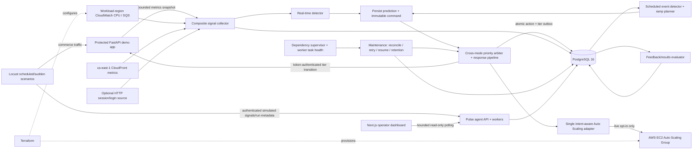
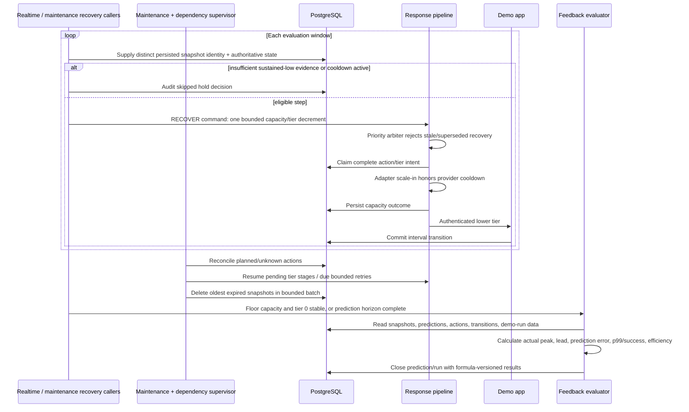

# Software Design Document

**Artifact slug:** `complete-predictive-surge-platform`

**Workflow ID:** `daefa536-d064-42a8-aaef-98272b2b332e`

**Title:** Complete Predictive Surge Platform

**Version:** 1.1 (post-implementation sync)

**Status:** IMPLEMENTED

**Implemented at:** `2026-08-18T17:09:31Z`

**As-built application SHA:** `034b82df24fda3abf9bd83eb48e229e885601385`

**Documentation-sync source SHA:** `41da588c0fea3d170bfbb848b5884a5d21bb4de2`

**RDD reference:** [complete-predictive-surge-platform-requirements.md](./complete-predictive-surge-platform-requirements.md)

## 1. System overview

Pulse extends the protected FastAPI commerce application and PostgreSQL schema into a complete,
local-first predictive traffic-surge platform. The as-built agent continuously collects application
and optional leading signals, detects scheduled ramps and unplanned acceleration, and turns both
modes into the same immutable `ResponseCommand`. One serialized priority arbiter refreshes
authoritative capacity and tier state, preserves the strongest active requirement, and routes safe
work through one audited response pipeline and one Auto Scaling adapter. The critical checkout
path remains normal at all protection levels. Predictions and every response outcome—including
dry-run, capped, skipped, failed, unknown, reconciled, tier-outbox, retry, and recovery decisions—
are persisted with UTC timestamps, correlation, bounded evidence, and human-readable reasoning.

The repository is a multi-service monorepo with separately runnable processes: the protected demo
application, a FastAPI Pulse control plane with real-time, scheduled, feedback, maintenance, and
dependency-supervision loops, a read-only Next.js operator dashboard, PostgreSQL, on-demand Locust
drivers, and Terraform for an optional small AWS target. Dashboard traffic history uses the
explicit `pulse.snapshot.v1` DTO rather than ORM serialization. The mandatory acceptance path runs
through Docker Compose without AWS credentials. Explicit live mode may use workload-region
CloudWatch CPU and SQS signals, `us-east-1` CloudFront metrics, an HTTP session/login source, and
EC2 Auto Scaling. Simple moving-average or exponential baselines remain replaceable strategies;
no heavyweight machine-learning runtime is required for v1.

### 1.1 In scope

- All 22 Must functional requirements and all 15 non-functional requirements in the RDD.
- All ten ordered product deliverables: repository boundaries, database schema, explicit control flow/state machine, protected demo app, real-time detector, scheduled detector, Locust scenarios, dashboard, complete operations documentation, and defensible measured results.
- A single dry-run-aware Auto Scaling adapter, hard global/event ceilings, command idempotency, recovery hysteresis, cooldown, and gradual scale-down.
- Reproducible local scheduled and sudden-spike demonstrations with captured run metadata and calculated portfolio metrics.
- Minimal low-cost Terraform, GitHub Actions verification, feature-branch delivery, and an open unmerged pull request.

### 1.2 Out of scope

- Production multi-region control-plane consensus, leader election, enterprise SSO, or a production commerce product.
- Automatic production deployment or merging the pull request.
- Committing measured claims not produced by an actual recorded run.
- Mandatory live AWS apply/mutation in the default scope; the adapter and Terraform remain fully implemented and testable without account credentials.
- Prophet, LSTM, or other heavyweight forecasting dependencies in v1.

### 1.3 Requirements coverage

| FR/NFR ID | Design section | Notes |
|-----------|----------------|-------|
| FR-1 | 2, 3, 9.4 | Explicit agent, app, common, DB, load-test, dashboard, infrastructure, test, script, and documentation paths. |
| FR-2 | 5 | The six-table baseline is retained and extended through reversible revisions `0002`–`0004`; run, retry, capacity-evidence, and tier-outbox records make decisions reproducible. |
| FR-3 | 2.4, 6 | One shared state machine covers scheduled and real-time detection, protection, recovery, cooldown, and failure-safe behavior. |
| FR-4 | 3, 4.1 | Existing commerce and observability endpoints remain stable and are regression-tested. |
| FR-5 | 2.5, 3, 4.4 | Existing tier matrix and persist-before-activation controller are retained and integrated with Pulse. |
| FR-6 | 2.2, 3, 4.3, 4.15 | Composite signal collection tolerates absent optional providers and records freshness/health. |
| FR-7 | 2.3, 3, 5, 6.1 | Rolling baseline, delta, derivative/acceleration, confirmation, hysteresis, confidence, and reactive comparator are deterministic. |
| FR-8 | 2.4, 3, 5, 6 | Both modes emit the same typed response command and idempotency key; every outcome is audited. |
| FR-9 | 2.5, 3, 5, 6 | One boto3 adapter defaults to dry-run, clamps before invocation, and captures provider outcomes. |
| FR-10 | 2.3, 3, 5, 6.2 | UTC event polling and stable ramp-point keys execute due points once. |
| FR-11 | 2.4, 2.5, 6.3 | Sustained-low confirmation, scale-down steps, cooldown, and reversible tier unwinding. |
| FR-12 | 2.6, 3, 4.12–4.14, 5 | Feedback evaluator persists onset/peak/error/lead/provisioning measures. |
| FR-13 | 3, 6.4, 9 | Timed Diwali and unannounced-spike Locust scenarios include run/reset scripts. |
| FR-14 | 2.7, 3, 4.5–4.14 | Polling Next.js dashboard renders traffic, capacity, tier, audit, and forecast overlay. |
| FR-15 | 4.5–4.14 | All graph/history endpoints are read-only, indexed, paginated, and time-bounded. |
| FR-16 | 2.8, 9.4 | Compose health/dependency order is PostgreSQL → migration → app/agent → dashboard. |
| FR-17 | 2.9, 3, 9 | Terraform provides bounded ASG, launch template, metrics/alarm, inputs, outputs, and least-privilege IAM. |
| FR-18 | 9 | Unit, integration, contract, migration, adapter, and local end-to-end tests cover both modes. |
| FR-19 | 9.3 | GitHub Actions verifies Python, PostgreSQL migrations, dashboard, Compose, Terraform, coverage, and secrets. |
| FR-20 | 9.4, 10 | README and supporting docs provide complete setup, diagrams, demos, results, troubleshooting, and cleanup guidance. |
| FR-21 | 2.6, 4.13–4.14, 5 | Critical-path p99/success, lead time, and provisioning efficiency are mandatory; error/recovery/cost duration are optional measured outputs. |
| FR-22 | 9.5 | Implementation is committed/pushed on the artifact-slug branch based on `codex/demo-app-foundation`; PR remains open. |
| NFR-1 | 2.5, 3, 5, 9 | Dry-run defaults and ceiling enforcement exist at configuration, service, adapter, test, Compose, and documentation layers. |
| NFR-2 | 2.5, 3, 4.1, 9 | Checkout never consults the shedding limiter and is tested at levels 0–3 and in both e2e modes. |
| NFR-3 | 2.4, 5, 6.3, 9 | Stable unique keys, transaction claims, locks, confirmation windows, and cooldown protect repeat polls/concurrency. |
| NFR-4 | 2.4–2.6, 5, 9 | Durable command/action/transition records include correlation, reason codes, text reasoning, and evidence. |
| NFR-5 | 2.2, 2.7, 4, 5 | Request middleware performs bounded in-memory work; DB writes occur in the agent; dashboard reads use bounded indexed queries. |
| NFR-6 | 2.3, 5, 6.1 | Trigger evidence includes baseline, delta/acceleration, confirmations, optional leading signals, and comparator time. |
| NFR-7 | 2.10, 4, 9 | Constant-time control-token checks, secret-safe examples, ignore rules, and no browser-held mutation token. |
| NFR-8 | 2.9, 3, 9 | IAM is action/resource scoped where AWS permits; runtime performs no resource creation. |
| NFR-9 | 2, 3, 5 | Python 3.11+, typed protocols/DTOs, injected clocks/clients, async DB access, and UTC-aware datetimes. |
| NFR-10 | 3, 9 | Deterministic clocks/providers and at least 85% Python coverage plus frontend/infrastructure checks. |
| NFR-11 | 4.2, 4.5, 9 | Health and status identify DB, sources, worker state, mode, capacity, cooldown, and tier without secrets. |
| NFR-12 | 2.2, 2.8, 6.4, 9 | Local providers and Compose require no AWS credentials; optional signals are explicitly absent/simulated. |
| NFR-13 | 5, 9 | Reversible migrations, timezone-aware columns, audit-preserving FKs, typed graph/result fields, and migration tests. |
| NFR-14 | 2.2–2.7, 4, 5 | All intervals/windows/thresholds/ratios are configured and all histories are bounded. |
| NFR-15 | 2.6, 4.13–4.16, 5, 9 | Demo-run records preserve scenario, thresholds, mode, baseline definition, formulas, timestamps, and generated summaries. |

## 1b. Approved scope decision (design history)

**Scope (choose one — default: Option 1):**

- (x) **Option 1 — Complete local-first A-to-Z platform** — includes every Must FR/NFR and all ten deliverables: both detectors, unified response/recovery, protected app, full persistence and evaluation, two reproducible Locust modes, live dashboard, Compose, tested boto3 adapter, minimal Terraform, CI, complete docs/results workflow, push, and open PR. Live AWS resources are not applied and no live capacity mutation is performed without account inputs; advanced forecasting is limited to the replaceable simple-statistics/exponential-smoothing boundary.
- ( ) **Option 2 — Complete platform plus live AWS evidence** — includes Option 1 and, after the user supplies/authorizes region, networking, credentials, instance type, ceiling, and spend, applies the low-cost Terraform stack, executes one bounded live scaling demonstration, records provider request IDs/metrics, and destroys the stack. Excludes production hardening, multi-region operation, and advanced forecasting experiments.
- ( ) **Option 3 — Complete platform plus live AWS and forecasting comparison** — includes Option 2 and adds a lightweight Holt-Winters/exponential-smoothing model comparison, model-selection evidence, dashboard comparison view, and measured model-quality tests. Excludes heavyweight Prophet/LSTM dependencies and production multi-region operation.

**Cleanup (optional — check to include):**

- [ ] **Remove unused files and dead code** in the affected area (beyond mandatory remove-on-touch cleanup; superseded files, orphaned tests, and stale configuration are deleted).

> Selecting Option 1 does not defer any requested platform deliverable. Options 2 and 3 require external AWS state or add forecasting experiments beyond the complete v1 acceptance path.

## 2. Architecture

### 2.1 Logical architecture

Pulse uses one repository and shared database but separates runtime responsibilities. The protected demo app owns request behavior, in-process rolling metrics, and the authoritative shedding controller. The agent owns collection, detection, scheduling, forecasting, response decisions, AWS integration, recovery, feedback evaluation, and read-only operator APIs. Both use shared typed contracts and repositories but do not import each other's business services. The agent changes application protection only through the authenticated internal HTTP API, preserving the application's persist-before-activate invariant.

The agent runs as a single active process per environment in v1. Its real-time, scheduled, feedback,
and maintenance workers run as independent bounded tasks; maintenance performs shared recovery,
provider reconciliation, tier-outbox resumption, bounded retries, and retention. A separately managed
dependency supervisor recreates failed database/client generations. A common injected clock makes
timed decisions deterministic in tests. PostgreSQL unique idempotency keys, transactional claims,
and the serialized priority arbiter protect repeated polling and cross-mode races. Runtime
configuration validates safety bounds at startup, and every mutation path delegates to the same
response pipeline and one capacity adapter.



### 2.2 Signal collection and persistence

`SignalProvider` is a typed async protocol returning
`SignalReading(source, observed_at, status, values, freshness_seconds, details)`. The assembled
runtime always includes the demo-app snapshot over `httpx` and the bounded simulated provider.
Explicit live mode may add CloudWatch ASG CPU in the configured workload region, CloudFront request
rate through a separate `us-east-1` CloudWatch client, and SQS depth/growth in the workload region;
an HTTP session/login provider is independently optional. SDK clients have bounded connect/read
timeouts and attempts. The collector treats origin metrics as required and leading providers as
optional. Omitted, stale, timed-out, and unavailable sources reduce confidence and remain visible
in `signal_details`; they do not invent values or stop the worker (FR-6, R-4).

The collector keeps only enough in-memory samples for the configured window and persists every
evaluated aggregate as `traffic_snapshots`. Endpoint metrics include checkout p99 and success
rate. Each production snapshot also stores authoritative ASG desired/in-service capacity and the
effective RPS-per-instance assumption used by results evaluation. PostgreSQL history supplies
restart continuity and dashboard data. Collection uses a short timeout and no protected request
performs database or external-provider I/O (NFR-5, NFR-14).

### 2.3 Detection and forecasting

The real-time evaluator reads a fixed, time-ordered window and computes:

- baseline request rate: mean or exponentially smoothed rate over the baseline window;
- request-rate delta: current rate minus the preceding rate;
- normalized acceleration: delta divided by elapsed seconds;
- current-to-baseline and edge-to-origin ratios;
- queue, session, and login growth when fresh;
- confidence: a configured weighted score from acceleration confirmation, sustained ratio, leading-signal agreement, sample sufficiency, and freshness;
- reactive comparator state: the first timestamp at which CPU or configured raw-load threshold crosses its limit.

A trigger requires minimum sample count, acceleration/ratio threshold, configured consecutive confirmations, and minimum confidence. Exit thresholds are lower than entry thresholds. Strategy interfaces allow a deterministic moving-average/derivative implementation and an optional exponential-smoothing implementation without coupling the response pipeline to a forecasting package (FR-7, NFR-6).

The scheduled evaluator queries active events whose prewarm/recovery horizon intersects `now`. `RampPlanner` validates timezone-aware event data, ceiling, and monotonically increasing pre-start capacity points. It either uses the stored profile or derives linear steps from minimum to peak between `starts_at - prewarm_lead_seconds` and `starts_at - peak_lead_seconds`. Each due point has the stable key `scheduled:{event_id}:{offset_seconds}:{desired_capacity}` and is submitted exactly once. Post-event recovery uses the shared sustained-low/cooldown path rather than an unconditional drop (FR-10, FR-11).

### 2.4 Shared state machine and command contract

Both detectors emit a `SurgePredictionCandidate`; `PredictionService` persists it and produces the same immutable `ResponseCommand`:

```text
command_id / idempotency_key
correlation_id and optional demo_run_id
prediction_id, trigger_snapshot_id, scheduled_event_id
mode, response intent (detector / prewarm / protect / recover / hold), and target_resource
requested_desired_capacity and maximum_ceiling
optional requested_shedding_level
reason_code, reasoning, signal_evidence
recovery_plan {low_threshold, confirmation_count, cooldown_seconds, decrement_step, floor}
```

| State | Entry | Permitted actions | Exit |
|-------|-------|-------------------|------|
| `NORMAL` | Startup or completed cooldown | Collect/persist; no protection mutation | Confirmed real-time evidence → `WATCH`; scheduled horizon → `PREWARM`; persistence/provider fault → `FAILURE_SAFE` |
| `WATCH` | First qualifying real-time evidence | Persist snapshots; wait for confirmations | Confirmed confidence → `PROTECT`; scheduled horizon → `PREWARM`; evidence falls below exit threshold → `NORMAL` |
| `PREWARM` | A scheduled ramp horizon opens | Claim/execute due capacity points; optionally tier 1 immediately before event | Event/surge threshold → `PROTECT`; cancelled event with low load → `RECOVERY` |
| `PROTECT` | Confirmed surge or event peak window | Scale out up to ceiling; set tier appropriate to pressure | Sustained low evidence after event/peak → `RECOVERY`; fault → `FAILURE_SAFE` |
| `RECOVERY` | Low-load confirmation count met | Lower tier one step and capacity by bounded decrement | Scheduled horizon → `PREWARM`; remaining protection/capacity → `COOLDOWN`; floor and tier 0 → `NORMAL` |
| `COOLDOWN` | Any scale/tier reduction | Continue observing/auditing; reject repeated reductions; protection may interrupt | Scheduled horizon → `PREWARM`; timer expires → `RECOVERY`; renewed high evidence → `PROTECT` |
| `FAILURE_SAFE` | DB unavailable, invalid config, app control failure, or provider failure | No unaudited AWS/tier mutation; preserve durable intent/current tier; report health 503; bounded retry | Supervisor/maintenance reconcile dependencies then select `WATCH`, `PROTECT`, or `RECOVERY` from authoritative evidence |

### 2.5 Response safety and ordering

For each command, `ResponsePipeline` performs the following order (FR-8, FR-9, NFR-1, NFR-4):

1. Enter a serialized priority arbiter (`PROTECT`/`PREWARM`/detector before `HOLD`, with `RECOVER`
   lowest), validate UTC/target/tier/recovery fields, and re-read authoritative capacity and tier.
   Merge the maximum requirement for each active mode/event. Reject stale recovery and every
   non-recovery decrease before claim or mutation.
2. Derive `min(global_ceiling, command/event ceiling)`, clamp the request, and transactionally claim
   the stable idempotency key. Revision 0004 stores the complete serialized command, requested tier,
   and pending tier stage on that same planned action before any external work. A duplicate returns
   the existing capacity result and resumes only an incomplete tier stage.
3. In dry-run, use simulated/current capacity, record `dry_run`, `noop`, or `capped`, and never
   construct or invoke a boto3 client.
4. In live mode, call only `AutoScalingCapacityAdapter`. It rechecks target and ceiling, reads the
   ASG, and calls `SetDesiredCapacity` once. Scale-out (`DETECTOR`, `PREWARM`, or `PROTECT`) uses
   `HonorCooldown=False`; only a validated `RECOVER` decrease uses `HonorCooldown=True`.
   Ambiguous provider errors become `unknown`, and maintenance reconciles them by read-only
   capacity observation before any later scale-in.
5. Persist the capacity outcome, then deliver the pending tier through the demo app's authenticated
   endpoint. The demo app commits the interval before activating policy. Success completes the
   outbox; failure leaves the prior policy active and the tier stage pending with bounded attempts.
   A bounded `response_retries` row supplies backoff when available, but the action outbox itself is
   sufficient for restart continuation with the original correlation and without another capacity
   mutation.
6. Record state/cooldown. One shared recovery coordinator deduplicates sustained-low evidence by
   persisted snapshot ID across realtime and maintenance callers. Renewed protection supersedes
   recovery immediately; only recovery can decrease capacity or tier.

Checkout is structurally excluded from the policy matrix and from the token bucket. The response pipeline can request only an enumerated tier, never endpoint-level overrides (NFR-2).

### 2.6 Feedback loop and result formulas

`FeedbackEvaluator` closes a prediction after its configured horizon and closes a demo run after
the load wrapper reports completion. It joins typed prediction points, traffic snapshots, scaling
actions, and tier intervals by `demo_run_id`, environment, and time range. Run creation replaces
caller-asserted control settings with a sanitized server-effective `settings_snapshot_version=v1`
record containing pair identity, workload seed/duration/host/weights, thresholds, execution mode,
target, provider configuration, ceilings, and RPS-per-instance. Result calculation requires the
persisted capacity evidence; absent inputs remain unavailable with warnings. API responses disclose
the observation interval, scenario, execution mode, formulas, settings, and record references.

Mandatory metrics (FR-12, FR-21):

- **Critical checkout p99**: percentile of checkout request latencies recorded by the demo app for the run; **checkout success rate** = successful checkout responses / checkout attempts.
- **Detection lead time** = `reactive_comparator_crossed_at - prediction.created_at`; negative/absent comparator cases are labeled, not coerced into a positive claim.
- **Provisioning efficiency** = required instance-minutes / provisioned instance-minutes × 100, where required instances at each snapshot are `ceil(actual_rps / configured_capacity_per_instance)` and provisioned instances use audited desired capacity. Division-by-zero yields `not_available`.
- **Prediction error** = `abs(predicted_peak_rps - actual_peak_rps) / max(actual_peak_rps, epsilon) × 100`.
- **Over-provisioned instance-minutes** = time integral of `max(provisioned - required, 0)`; **under-provisioned seconds** integrates intervals where required exceeds provisioned.
- Optional displayed metrics: error-rate reduction relative to the paired reactive-only run and recovery/cost duration from peak until floor capacity/tier 0.

No percentage improvement is committed in documentation unless both compared runs exist and are referenced by IDs (NFR-15, R-7).

### 2.7 Dashboard

The dashboard is a small Next.js/React application with browser polling and a lightweight SVG line
chart. A single configurable refresh interval (default 2 seconds, minimum 1 second) fetches status
and time-bounded history in parallel, cancels stale requests, and retains only the selected
15-minute, 1-hour, or 6-hour window. Snapshot history, status `latest_snapshot`, and prediction
`actual_snapshots` use `DashboardSnapshotV1`/`DashboardSnapshotPageV1` with
`schema_version="pulse.snapshot.v1"`. The DTO exposes explicit ASG desired/in-service fields and
derives `pending_capacity=max(desired-in_service, 0)`; this is outstanding capacity, not an exact
AWS lifecycle-state count. The browser rejects unsupported rows with a visible warning. Views
include detector/dependency/provider health; traffic and checkout p99/success; actual versus
predicted RPS; capacity; tier/policy; schedule; actions; and results. It receives no control token
and exposes no mutation UI (FR-14, R-8).

### 2.8 Local deployment

Compose defines `postgres`, one-shot `migrate`, `demo-app`, `agent`, and `dashboard`, plus a
profile-only `locust` service. PostgreSQL readiness gates migration; successful migration gates the
demo app and agent, demo-app health also gates the agent, and agent health gates the dashboard.
The agent starts realtime, scheduled, feedback, and maintenance workers plus an independent
database supervisor. Initial or runtime database failure returns health 503 while tasks remain
alive and retry on bounded polls; readiness returns to 200 in-process after recovery. Defaults use
dry-run and only demo/simulated providers. Containers have explicit health checks, non-root app
images, restart policies, bounded JSON logs, and a Compose-project-scoped database volume. Locust
does not start with the normal stack (FR-16, NFR-12).

### 2.9 AWS deployment boundary

Terraform provides a launch template with IMDSv2, encrypted storage, configurable AMI/instance
type/user data, an ASG with desired/minimum one and conservative maximum three (validated hard
maximum five), supplied VPC/subnet/security-group inputs, a `Pulse/Traffic` custom metric/alarm
representing the reactive comparator, and a Pulse IAM policy/role. It is a bounded ASG/control
target; the default user data does not deploy PostgreSQL, the applications, ingress, or DNS.
Outputs include ASG name/ARN, alarm name, role/policy ARN, and capacity bounds. CI runs
format/init-without-backend/validate and policy assertions only; it never plans or applies.

IAM permits only required reads/publishing and `autoscaling:SetDesiredCapacity` scoped to the
configured ASG ARN; APIs such as `DescribeAutoScalingGroups` and CloudWatch reads that do not
support resource scoping use `Resource: *` with documented conditions where supported. Optional
SQS reads are scoped to one queue. Live providers use bounded boto3 configuration, workload-region
CPU/SQS clients, and a separate `us-east-1` CloudWatch client for global CloudFront metrics. The
runtime cannot create, delete, or reconfigure arbitrary AWS resources (FR-17, NFR-8, R-9).

### 2.10 Security and secret handling

Internal signal/run and shedding mutation routes use `X-Pulse-Control-Token` and `secrets.compare_digest`. Read-only demo/status APIs are unauthenticated for the local portfolio environment; AWS security-group and bind-address inputs restrict their exposure in live demos. CORS permits only configured dashboard origins. Logs and APIs omit credentials/token values. `.gitignore` excludes `.env`, Terraform state/plan files, generated load results, Node build directories, and credential artifacts. Examples contain placeholders/local-only values and use environment/default AWS credential resolution (NFR-7).

## 3. Components

| Component | As-built responsibility | Status | FR/NFR |
|-----------|-------------------------|--------|--------|
| `common.contracts` / enums | Frozen signal, prediction, response-intent, recovery, capacity, worker, run/result, query, and `pulse.snapshot.v1` DTO contracts | Implemented | FR-1, FR-8, FR-14, NFR-9 |
| Protected commerce routes/policy/limiter | Stable checkout/catalog/recommendation behavior; checkout structurally bypasses every non-critical policy | Preserved and verified | FR-4, FR-5, NFR-2 |
| Demo metrics and operations | Bounded fixed-cardinality request metrics, typed readiness/snapshot responses, constant-time authenticated persist-before-activate tier transitions | Implemented | FR-5, FR-6, NFR-4, NFR-7 |
| Models, revisions `0001`–`0004`, and repositories | Async bounded CRUD, run attribution, predictions, exact-once claims, atomic tier outbox, response retries, capacity assumptions, retention, and operator reads | Implemented | FR-2, FR-8, FR-10, FR-12, NFR-13 |
| `agent.app.config` and `AgentRuntime` | Validate every safety/window/provider/retry/retention setting and own clock, simulated buffer, and managed clients | Implemented | FR-7–FR-11, NFR-1, NFR-14 |
| Composite providers/collector | Required demo origin plus simulated and optional regional AWS/HTTP signals; freshness/timeout health; capacity-backed snapshots | Implemented | FR-6, NFR-6, NFR-12 |
| Real-time detector, worker, and lifecycle | Baseline/change/acceleration/confidence/hysteresis, run isolation, comparator persistence, WATCH/protection/recovery integration, and DB-outage-safe bounded polling | Implemented | FR-7, FR-11, NFR-3, NFR-6 |
| Scheduled worker and ramp planner | Timezone/DST validation, monotonic bounded ramps, latest-safe restart catch-up, exact-once keys, near-event protection, and shared recovery | Implemented | FR-10, FR-11, NFR-3 |
| Prediction service | Atomically persist prediction/points and produce the shared immutable command for either mode | Implemented | FR-3, FR-8, NFR-4 |
| Priority arbiter, state machine, response pipeline | Serialize all intents, refresh authoritative state, merge active requirements, double-clamp, claim action+tier outbox, and block unsafe decreases | Implemented | FR-3, FR-8, FR-11, NFR-1–NFR-4 |
| Recovery, maintenance, reconciliation, and dependency supervisor | Deduplicate low evidence, apply bounded recovery, reconcile unknown outcomes, resume tier outbox/retries, prune snapshots, and publish recoverable readiness | Implemented | FR-8, FR-11, NFR-3, NFR-11, NFR-14 |
| Auto Scaling adapter | Credential-free dry-run plus one bounded live boto3 read/mutation path with intent-aware `HonorCooldown` and sanitized ambiguity | Implemented | FR-9, NFR-1, NFR-8 |
| Shedding HTTP client | Server-side token-authenticated status/transition calls with timeouts, sanitized errors, and retry classification | Implemented | FR-5, FR-8, NFR-7 |
| Feedback service/worker | Close persisted runs and predictions with formula-v1 metrics, effective settings, evidence references, and explicit warnings | Implemented | FR-12, FR-21, NFR-15 |
| Agent API/lifespan | Dynamic `/health`, bounded `/api/v1` reads, strict authenticated writes, CORS, worker task inspection, and graceful ownership | Implemented | FR-6, FR-10, FR-15, NFR-11 |
| Locust scenarios/wrappers/scripts | Scheduled Diwali and sudden spike, equal-input pairing, server-attributed run lifecycle, reset, verification, and export | Implemented | FR-13, FR-21, NFR-15 |
| Next.js dashboard | Read-only polling UI with versioned snapshot validation, partial-failure handling, and operations/results views | Implemented | FR-14, NFR-5, NFR-14 |
| Docker/Compose images | Health-gated credential-free stack with non-root app images, bounded logs, project-scoped storage, and profile-only load driver | Implemented | FR-16, NFR-12 |
| Terraform | Low-cost existing-network launch template/ASG, comparator alarm, scoped runtime IAM, variables, outputs, and manual apply/destroy boundary | Implemented; not applied | FR-17, NFR-1, NFR-8 |
| GitHub Actions | Six jobs for Python/PostgreSQL/dashboard/Compose+Locust/Terraform/secrets and diff hygiene | Implemented and green | FR-19, NFR-7, NFR-10 |
| README/shared docs/history | Architecture/state/runbook/results guidance, rollout/rollback, traceability, and business-readable delivery history | Implemented | FR-20–FR-22, NFR-15 |

## 4. APIs

All timestamps use RFC 3339 UTC. Bounded list responses use
`{items, next_cursor, from, to}`; omitted `from`/`to` resolve to the configured default window,
`limit` defaults to at most 200 and is capped by `query_max_rows` (maximum 1,000), and cursors are
opaque/capped. UUIDs are canonical strings. Agent errors use `{detail, code, errors?}`; demo-control
errors may also include `correlation_id`. Pydantic request DTOs forbid unknown fields except the
preserved `CheckoutRequest`, which intentionally ignores additive client metadata for backward
compatibility. The 16 endpoints marked **new** or **changed** below comprise the handoff API count.

### 4.0 Final shared DTOs

| DTO | Fields / invariant | Consumers |
|-----|--------------------|-----------|
| `SignalReading` | `source`, UTC `observed_at`, provider `status`, up to 32 numeric `values`, non-negative `freshness_seconds`, bounded/sensitive-key-rejecting `details` | composite collector and all providers |
| `ResponseCommand` | stable key/correlation/run/prediction/snapshot/event references; mode plus `intent`; target/request/ceiling/tier; bounded reason/evidence; recovery plan | realtime/scheduled/recovery, priority arbiter, outbox, retries, adapter |
| `DashboardSnapshotV1` | literal `schema_version="pulse.snapshot.v1"`; traffic/baseline/change/acceleration/optional signals; latency/checkout/error; explicit `asg_desired_capacity`, `asg_in_service_capacity`, derived non-negative `pending_capacity`; positive `capacity_per_instance_rps`; tier/comparator/evidence | `/api/v1/snapshots`, status `latest_snapshot`, prediction `actual_snapshots`, dashboard |
| `DashboardSnapshotPageV1` | tuple of v1 snapshots plus bounded cursor and UTC `from`/`to` | dashboard traffic/capacity history |
| `CapacityState` / `CapacityDecision` | non-negative desired/in-service/pending observation; requested/applied/ceiling/mode/status/request ID/sanitized error with `applied <= ceiling` | status, pipeline, adapter, audit |
| `DemoRunSpec` / `ResultMetrics` | idempotent scenario/run identity and server-effective settings; formula-v1 checkout, lead, provisioning, prediction, over/under, error, recovery, cost, warnings | internal run API, feedback, results, export |
| Demo-app DTOs | `CheckoutRequest`, strict `SheddingTransitionRequest`, `SheddingStateResponse`, `TrafficSnapshotResponse`, `ApplicationHealthResponse` | protected and operational demo routes |

### 4.1 Preserved commerce contracts (unchanged; not counted)

- `POST /checkout`: unauthenticated; validates `{cart_id, item_count}` while ignoring additive
  unknown request fields; always returns normal endpoint mode and never 429 due to Pulse.
- `GET /recommendations`: unauthenticated; normal, disabled/minimal, or emergency-rate-limited according to the tier.
- `GET /catalog`: unauthenticated; normal, stale-cached, or emergency-rate-limited according to the tier.
- Validation returns HTTP 422. These contracts receive regression/e2e coverage but no incompatible schema change.

### 4.2 Demo application health — changed

- **Method / Path:** `GET /health`
- **Auth:** none locally; network-restricted in AWS.
- **Request:** none.
- **Response:** `200` with service/environment, readiness, DB persistence status, tier/event/reason, endpoint policy, bounded metric summary, and `critical_path_protected: true`; `503` when the database-backed controller cannot be initialized.
- **Errors/readiness:** the same typed body is returned with HTTP 503 and `status=degraded` when
  persistence is unavailable or the authoritative state was not loaded; no token or internal
  exception text is returned.
- **Idempotency / rate limit:** safe read; excluded from traffic metrics and bounded by deployment-level limits.

### 4.3 Demo application traffic snapshot — changed

- **Method / Path:** `GET /metrics/snapshot`
- **Auth:** none on the internal Compose network; network-restricted in AWS.
- **Request:** optional `run_id` is not accepted from the public caller; current run association comes from agent collection context.
- **Response:** observed/window timestamps, origin RPS, request count, concurrent requests, aggregate percentiles/error rate, per-endpoint counts/p99/success, current tier/policy.
- **Errors:** validation is response-model enforced; an unexpected internal invariant failure is
  sanitized by the server as HTTP 500.
- **Idempotency / rate limit:** safe read; response work is O(samples in configured bounded window).

### 4.4 Demo application tier control — changed

- **Method / Path:** `POST /internal/load-shedding`
- **Auth:** required `X-Pulse-Control-Token`, compared in constant time.
- **Request:** `{level: 0..3, reason_code, reasoning, changed_by, signal_evidence, correlation_id?, prediction_id?, trigger_snapshot_id?, demo_run_id?}`.
- **Response:** `200` `{changed, event_id, level, level_name, started_at, reason_code, reasoning, endpoint_policies}`. Same-level commands return `changed:false` without another interval.
- **Errors:** HTTP 401 `INVALID_CONTROL_TOKEN`; 422 validation; 409 `TRANSITION_CONFLICT`; 503 `AUDIT_PERSISTENCE_UNAVAILABLE`. A persistence error leaves the in-memory tier unchanged.
- **Idempotency / rate limit:** serialized by the controller; duplicate level is a no-op; agent retries only timeout/503 with the same correlation.

### 4.5 Agent health — new

- **Method / Path:** `GET /health`
- **Auth:** none locally; network-restricted in AWS.
- **Request:** none.
- **Response:** `{service, environment, status, ready, database:{ready}, demo_app:{ready}, workers[]}`.
  `workers` includes realtime, scheduled, feedback, maintenance, and the database dependency
  supervisor with `name/status/checked_at/detail`. Actual task completion is inspected, not only
  the last heartbeat.
- **Errors/readiness:** HTTP 503 while the database is unavailable, a mandatory worker task is
  stopped/failed, or a mandatory worker/supervisor reports degraded/unavailable. Those conditions
  are readiness failures; the same tasks can remain live and return to 200 after recovery.
- **Errors:** HTTP 503 `NOT_READY`.
- **Idempotency / rate limit:** safe constant/bounded read; suitable for Compose health checks.

### 4.6 Agent operational status — new

- **Method / Path:** `GET /api/v1/status`
- **Auth:** none locally; configured CORS/network restriction.
- **Request:** optional `environment`.
- **Response:** execution mode/global ceiling/state, `database_ready`, `demo_app_ready`, a bounded
  live capacity read or `capacity_error`, tier/policy, cooldown and low-confirmation progress,
  versioned `latest_snapshot`, latest prediction/action, next scheduled point/event, configured and
  observed provider health, and actual worker/supervisor status.
- **Errors:** 422 invalid environment; 500 bounded query failure. Dependency and optional-provider
  state is returned inside the 200 status payload; readiness enforcement belongs to agent
  `/health`.
- **Idempotency / rate limit:** safe read; assembled from bounded latest-row queries and cached provider health.

### 4.7 Traffic snapshot history — new

- **Method / Path:** `GET /api/v1/snapshots`
- **Auth:** none locally.
- **Request:** `environment`, bounded `from`/`to`, `limit`, `cursor`, optional `demo_run_id`.
- **Response:** `DashboardSnapshotPageV1`; every item is exactly `pulse.snapshot.v1` and includes
  the DTO fields in §4.0. `pending_capacity` is derived from persisted desired minus in-service and
  is not an AWS lifecycle-state count.
- **Errors:** 422 invalid/unbounded range or limit; 500 query error.
- **Idempotency / rate limit:** safe read; `(environment, observed_at)` and run/time indexes; maximum range/rows enforced.

### 4.8 Prediction list — new

- **Method / Path:** `GET /api/v1/predictions`
- **Auth:** none locally.
- **Request:** bounded time range plus optional `mode`, `status`, `environment`, `demo_run_id`, `limit`, `cursor`.
- **Response:** prediction summaries with trigger, start/peak/end, baseline/peak/multiplier, confidence, capacity, status, actual/evaluation metrics, and reasoning.
- **Errors:** 422 invalid enum/range; 500 query error.
- **Idempotency / rate limit:** safe indexed/paginated read.

### 4.9 Prediction detail and overlay — new

- **Method / Path:** `GET /api/v1/predictions/{prediction_id}`
- **Auth:** none locally.
- **Request:** UUID path; optional bounded `include_actual_window_seconds` capped by configuration.
- **Response:** full prediction, evidence, predicted points, associated actions/transitions, and
  time-aligned `pulse.snapshot.v1` actual snapshots for chart overlay.
- **Errors:** 404 `PREDICTION_NOT_FOUND`; 422 invalid UUID/window; 500 query error.
- **Idempotency / rate limit:** safe bounded read.

### 4.10 Scaling-action history — new

- **Method / Path:** `GET /api/v1/scaling-actions`
- **Auth:** none locally.
- **Request:** bounded time range plus optional `status`, `execution_mode`, `correlation_id`, `prediction_id`, `demo_run_id`, `limit`, `cursor`.
- **Response:** persisted action columns including requested/applied/previous capacity, ceiling,
  dry-run/live outcome, cooldown, immutable `response_command`, requested tier and tier-stage
  status/attempt/error, reason/evidence, provider request ID, reconciliation time, and sanitized
  error. Command evidence is bounded; no credential material is returned.
- **Errors:** 422 invalid filter/range; 500 query error.
- **Idempotency / rate limit:** safe indexed/paginated read.

### 4.11 Load-shedding history — new

- **Method / Path:** `GET /api/v1/load-shedding-events`
- **Auth:** none locally.
- **Request:** bounded time range plus optional `environment`, `correlation_id`, `prediction_id`, `demo_run_id`, `active_only`, `limit`, `cursor`.
- **Response:** interval, from/to level, actor, reason/evidence, policy snapshot, and application status/error.
- **Errors:** 422 invalid filter/range; 500 query error.
- **Idempotency / rate limit:** safe indexed/paginated read.

### 4.12 Scheduled-event list — new

- **Method / Path:** `GET /api/v1/scheduled-events`
- **Auth:** none locally.
- **Request:** bounded `from`/`to`, optional `status`, `limit`, `cursor`.
- **Response:** event identity, UTC start/end plus IANA timezone, multiplier, ramp settings/profile,
  capacity bounds, confidence, source, status, and audit timestamps. The next aggregate due point
  is exposed by `/api/v1/status`; completed points are visible as scaling actions.
- **Errors:** 422 invalid range/filter; 500 query error.
- **Idempotency / rate limit:** safe indexed/paginated read. Events are created by the seed script in v1.

### 4.13 Results summary — new

- **Method / Path:** `GET /api/v1/results/summary`
- **Auth:** none locally.
- **Request:** bounded `from`/`to`, optional `environment`, `scenario`, `execution_mode`, `limit`, `cursor`.
- **Response:** completed-run cards containing critical p99/success, lead time, provisioning efficiency, prediction error, over/under-provisioning, error rate, recovery/cost duration, formula version, and comparability warnings.
- **Errors:** 422 invalid/unbounded filters; 500 query error.
- **Idempotency / rate limit:** safe indexed/paginated read; metrics are read from closed run summaries rather than recomputed on every dashboard poll.

### 4.14 Result run detail — new

- **Method / Path:** `GET /api/v1/results/runs/{run_id}`
- **Auth:** none locally.
- **Request:** UUID path.
- **Response:** run scenario/configuration/thresholds/timestamps/baseline definition, persisted metrics, referenced prediction/action IDs, chart time bounds, formula definitions, and status/warnings.
- **Errors:** 404 `RUN_NOT_FOUND`; 409 `RUN_NOT_COMPLETE` only when `require_complete=true`; 422 invalid UUID; 500 query error.
- **Idempotency / rate limit:** safe bounded read.

### 4.15 Simulated leading signals — new

- **Method / Path:** `POST /internal/signals/simulated`
- **Auth:** required `X-Pulse-Control-Token`, constant-time comparison.
- **Request:** `{observed_at, demo_run_id?, ttl_seconds, edge_request_rate_rps?, queue_depth?, concurrent_sessions?, login_rate_rps?, cpu_utilization_pct?, source}`; at least one signal is required and ranges are validated.
- **Response:** `202` with accepted fields, expiry, and provider status; values are consumed by the next collector poll and persisted in snapshot evidence.
- **Errors:** 401 invalid token; 409 duplicate signal; 422 invalid/expired timestamp, range, or
  empty signal; 429 bounded-buffer limit; 503 real-time worker unavailable.
- **Idempotency / rate limit:** idempotency is `(source, observed_at, demo_run_id)` within the TTL; bounded buffer and configured request rate.

### 4.16 Demo-run start — new

- **Method / Path:** `POST /internal/demo-runs`
- **Auth:** required `X-Pulse-Control-Token`.
- **Request:** strict `{scenario_name, mode, environment, baseline_type, execution_mode,
  configuration, thresholds, pair_group_id?, started_at?, idempotency_key}`. Caller settings are
  inputs, not authority: the server whitelists workload seed/duration/host/weights and records its
  own effective execution mode, thresholds, target, ceiling, RPS-per-instance, provider regions,
  and control settings under `settings_snapshot_version=v1`.
- **Response:** `201` new or `200` existing run identity, scenario/mode/environment/baseline,
  server execution mode, status/times, formula version, warnings, and current results.
- **Errors:** 401 invalid token; 409 conflicting idempotency payload; 422 invalid configuration; 503 persistence unavailable.
- **Idempotency / rate limit:** unique client idempotency key and one active run per environment,
  enforced by the database; retries with the same logical payload return the existing run.

### 4.17 Demo-run completion — new

- **Method / Path:** `PATCH /internal/demo-runs/{run_id}`
- **Auth:** required `X-Pulse-Control-Token`.
- **Request:** `{status: completed|failed|cancelled, ended_at, locust_summary, notes?}`; generated raw files are referenced by safe relative name only, never uploaded secrets.
- **Response:** `200` terminal or `pending_evaluation` run. A completed payload is evaluated
  immediately only when the configured feedback horizon has already elapsed; otherwise the
  feedback worker closes it later. Identical terminal payloads are idempotent.
- **Errors:** 401 invalid token; 404 run missing; 409 already closed/conflicting completion; 422 invalid time/status; 503 persistence/evaluation unavailable.
- **Idempotency / rate limit:** repeat of the same terminal payload returns the existing result; conflicting terminal state returns 409.

## 5. Data model

### 5.1 Entities

| Entity | As-built change | Key fields / role | Integrity / access |
|--------|-----------------|-------------------|--------------------|
| `traffic_snapshots` | Extended by 0002 and 0004 | run ID; origin/baseline/change/acceleration/optional signals; request/concurrency/latency/checkout/error; desired/in-service capacity; positive `capacity_per_instance_rps`; tier/comparator/evidence | unique environment/time; run/time index; value checks; oldest-first bounded retention |
| `scheduled_events` | Baseline retained | UTC start/end, IANA timezone, multiplier, lead times, ramp profile, minimum/peak/event ceiling, status | status/start index; time/capacity/ceiling checks |
| `surge_predictions` / points | Extended by 0002 | run/environment/correlation/comparator/formula plus forecast and evaluation; points remain `(prediction_id, point_at)` | mode/status/time and run/time indexes; bounded point reads |
| `scaling_actions` | Extended by 0002 and 0004 | exact-once command/correlation/capacity/outcome plus serialized `response_command`, requested tier, tier status/attempt/error, provider/reconciliation metadata | unique idempotency key; action ceiling checks; pending-tier partial index; atomic capacity+tier intent claim |
| `load_shedding_events` | Extended by 0002 | run/prediction/snapshot/correlation, interval, levels, actor, reason/evidence/policy, app outcome | one open interval per environment; row lock; audit-preserving nullable links |
| `demo_runs` | Created by 0002 | idempotent run/pair identity, server-effective configuration/thresholds/mode, lifecycle, Locust summary, typed formula-v1 metrics, references/warnings | unique client key; one active run per environment; environment/time and scenario/status indexes |
| `response_retries` | Created by 0003 | unique dispatch/tier retry key, bounded command payload, desired tier, status/attempts/next time/error | due/correlation indexes, status/attempt checks, bounded exponential backoff; delivery aid rather than capacity authority |

`demo_run_id` foreign keys use `ON DELETE SET NULL` so operational audit survives intentional test-run cleanup. Prediction points cascade only with their prediction. Scheduled-event, prediction, and snapshot records otherwise preserve history. All persisted datetimes are timezone-aware; the application normalizes them to UTC while retaining the event's IANA timezone string.

### 5.2 Repository and transaction design

- `SnapshotRepository` inserts evaluated rows, serves bounded time/run queries, returns latest
  evidence, and deletes the oldest expired IDs in bounded transactions.
- `ScheduledEventRepository` locks/reads due events. Ramp exact-once behavior is represented by the scaling-action idempotency row rather than a second mutable scheduler ledger.
- `PredictionRepository` commits prediction and points in one transaction and updates evaluation fields atomically.
- `ScalingActionRepository.claim(idempotency_key, command)` uses insert-on-conflict/read-existing
  semantics and atomically stores the complete command/requested tier stage; provider work never
  occurs unless this durable intent exists. Duplicate capacity work is skipped while an incomplete
  tier stage can resume.
- `LoadSheddingStore` retains its row lock, interval close, and new interval insert in one transaction.
- `DemoRunRepository` provides idempotent start/terminal transition and persists formula/versioned results.
- `ResponseRetryRepository` schedules unique dispatch/tier retries, caps payload and attempts,
  and supplies bounded due reads/reschedule/final status. Failure to enqueue a retry does not erase
  the authoritative pending tier stage on `scaling_actions`.
- `OperatorQueryRepository` applies configured time/row/cursor bounds. Snapshot paths serialize
  through `DashboardSnapshotV1`; the remaining internal v1 operator rows use typed model columns.

Every repository accepts an async session factory; service tests inject fakes and integration tests use PostgreSQL. No route manipulates ORM entities directly (NFR-9).

### 5.3 Migration approach

The final schema head is `20260818_0004`:

1. `0001_initial_schema` is the retained six-table baseline.
2. `0002_control_plane_extensions` creates `demo_runs`; adds run, correlation, request,
   concurrency, checkout, comparator, reconciliation, and formula fields; backfills prediction
   correlation; and adds checks, nullable audit-preserving foreign keys, and bounded query indexes.
3. `0003_runtime_reliability` creates `response_retries` with bounded command JSON, unique keys,
   lifecycle/attempt checks, and due/correlation indexes.
4. `0004_review_runtime_safety` adds positive per-snapshot RPS-per-instance and the atomic
   scaling-action tier outbox (`response_command`, requested tier, status, attempts, error, and
   pending index).

All four revisions have executable downgrades. CI proves PostgreSQL 16
`base → 0004 → base → 0004` and live repository behavior. Downgrade is structurally reversible but
deletes the data held in removed tables/columns; writers must be stopped and pending actions/tier
stages reconciled or abandoned before rollback. Final app/agent writers require revision 0004.

### 5.4 Retention and bounded data

Default retention is configurable and enabled: raw snapshots older than seven days are deleted by
the maintenance worker in oldest-first batches of 500. Audit/prediction/run/action/tier/retry
records remain until explicit cleanup; nullable snapshot foreign keys preserve higher-level audit.
Simulated readings expire by TTL. API queries are capped at the configured maximum window (one day
locally) and 1,000 rows; browser memory retains only the selected visible window. Environments that
need longer raw history must change retention deliberately and export/back up evidence before the
first maintenance cycle (NFR-14).

### 5.5 Sensitive data

No entity stores credentials, request bodies, shopper PII, cart content, or control tokens. `cart_id` and `user_id` are not placed in metrics. Evidence is limited to aggregate numeric signals, provider status, thresholds, and sanitized AWS error metadata. Provider request IDs are operational identifiers, not credentials (NFR-7).

## 6. Sequence flows

### 6.1 Unannounced real-time surge

```mermaid
sequenceDiagram
  participant L as Locust sudden spike
  participant D as Protected demo app
  participant W as Real-time worker
  participant P as PostgreSQL
  participant R as Priority arbiter / response pipeline
  participant A as Auto Scaling adapter

  L->>D: Checkout/catalog/recommendation traffic
  L->>W: Authenticated optional simulated edge/queue/CPU signals
  loop Configured poll interval
    W->>P: Read active run identity
    alt active-run lookup unavailable
      W->>W: Health unavailable; no collect/detect/mutate; bounded retry
    else run identity available
      W->>D: GET /metrics/snapshot
      W->>W: Merge fresh providers; compute baseline/change/acceleration/confidence
      W->>P: Persist capacity-backed traffic snapshot
      alt confirmation threshold reached
        W->>P: Persist prediction and forecast points
        W->>R: Immutable command with PROTECT/detector intent
        R->>A: Refresh authoritative capacity
        R->>D: Read authoritative tier
        R->>R: Priority/active-requirement/ceiling checks
        R->>P: Atomic claim: action + complete command + pending tier
        alt dry-run (default)
          R->>A: Simulated execution (no boto3 client)
        else explicit live scale-out
          R->>A: SetDesiredCapacity, HonorCooldown=false
        end
        R->>P: Persist capacity outcome
        R->>D: POST /internal/load-shedding with token/correlation
        D->>P: Commit interval before activation
        D-->>R: Applied tier/policy
        R->>P: Complete tier stage or retain pending outbox
      end
    end
  end
```

If the active-run lookup, snapshot/prediction persistence, or action claim fails, the worker makes
no AWS or tier call. Its outer cycle fence rethrows cancellation but converts every other exception
to unavailable health and keeps polling. Optional stale signals are excluded. An unambiguous live
capacity failure is audited and may still permit protective tier delivery; an ambiguous mutation is
`unknown`, blocks scale-in, and is reconciled before more recovery work (R-3, R-4, R-5).

### 6.2 Scheduled Diwali prewarm

```mermaid
sequenceDiagram
  participant S as Seed script
  participant P as PostgreSQL
  participant W as Scheduled worker
  participant R as Planner / priority arbiter / pipeline
  participant A as Capacity adapter
  participant D as Demo app

  S->>P: Upsert active timezone-aware Diwali event and ramp
  loop Scheduled poll
    W->>P: Read events intersecting prewarm/recovery horizon
    W->>R: Submit latest due safe ramp with PREWARM intent/event key
    R->>R: Refresh capacity/tier; retain strongest overlapping event
    R->>P: Claim action + optional tier stage
    alt already claimed
      P-->>R: Existing outcome; no provider call
    else new claim
      R->>A: Dry-run or live increase (HonorCooldown=false)
      A-->>R: Result
      R->>P: Persist outcome
    end
  end
  R->>D: Optional level 1 transition near event start
  D->>P: Persist transition before activation; complete outbox
```

Restarting the worker re-derives the same ramp keys; completed points are no-ops and overdue points are handled by a configured catch-up policy that selects the latest due safe capacity rather than replaying every obsolete mutation.

### 6.3 Recovery, cooldown, and feedback



New qualifying high-load evidence interrupts recovery and returns to `PROTECT`; live scale-out does
not wait for ASG cooldown. Lowering protection requires a unique persisted low snapshot,
confirmation threshold, Pulse cooldown, `RECOVER` intent, and provider cooldown. The dependency
supervisor and task inspection keep health truthful while maintenance reconciles/resumes durable
work (FR-11, NFR-3).

### 6.4 Reproducible local scenario lifecycle

1. `scripts/reset_demo.py` closes stale demo runs, returns tier to 0 through the authenticated API, clears only opted-in generated/simulation state, and upserts deterministic defaults.
2. `scripts/seed_scheduled_events.py` upserts the Diwali event relative to a provided start time and prints its UUID/configuration.
3. A wrapper creates a `demo_runs` record with pair identity. The server persists sanitized
   effective workload/control/provider settings, then the wrapper starts Locust headless and posts
   deterministic leading-signal frames when required.
4. The scheduled scenario ramps traffic around the seeded event; the sudden scenario starts from a steady baseline and then applies an unannounced steep ramp. Both mix checkout, catalog, and recommendations.
5. The wrapper posts Locust summary values to the terminal run endpoint. The evaluator waits for
   the configured feedback horizon, joins persisted capacity-backed `pulse.snapshot.v1` evidence,
   and the wrapper exports a JSON/Markdown summary from the run-detail API.
6. The README gives exact commands for a Pulse run and a reactive-only comparator run. Output directories are gitignored and claims remain tied to run IDs.

## 7. Risks

| ID | Risk | Impact | Mitigation | Owner phase |
|----|------|--------|------------|-------------|
| R-1 | Erroneous configuration requests excessive live capacity | High cost/account impact | Default dry-run, startup validation, global/event minimum clamp in service and adapter, low Terraform maximum, action audit | Control-plane/AWS implementation |
| R-2 | Noisy samples cause false positives or flapping | Service/cost instability | Bounded rolling windows, minimum samples, consecutive confirmations, confidence, asymmetric hysteresis, cooldown, deterministic noise tests | Detection/recovery implementation |
| R-3 | Instances become healthy slower than demand rises | Checkout risk | Acceleration/leading signals, scheduled prewarm, configurable warm-up, immediate non-critical shedding, pending-capacity status | Detection/AWS/e2e |
| R-4 | Optional provider is missing/stale/delayed | Reduced confidence | Per-provider timeout/freshness/health, graceful omission, application fallback, reproducible simulated provider | Signal collection |
| R-5 | PostgreSQL failure prevents audit | Control unavailability | Fail closed against new mutations, planned-before-provider ordering, bounded retry, degraded health, reconciliation after recovery | Persistence/response |
| R-6 | Repeated/overlapping polls duplicate a ramp/action | Cost and confusing audit | Stable keys, unique constraint, transactional claim, in-process worker guard, concurrency tests | Scheduler/response |
| R-7 | Workstation/AWS variance makes benchmark claims misleading | Portfolio credibility | Persist environment/config/raw summary, paired runs, formula version, report ranges, never fabricate improvements | Load tests/results/docs |
| R-8 | Dashboard polling overloads API or exposes controls | Performance/security | Time/row caps, indexes, polling floor/cancellation, configured CORS, read-only browser, no token in frontend | API/dashboard |
| R-9 | AWS networking/quota/default VPC differs | Apply/demo failure | Explicit validated variables, optional ALB, low defaults, preflight docs, outputs, destroy runbook, no CI apply | Terraform/docs |
| R-10 | Broad scope yields superficial placeholders | Delivery failure | Vertical implementation phases, complete scope table/checklist, strict traceability, no placeholder acceptance, end-to-end gates | Planning/QA/review |
| D-1 | Provider succeeds but final DB update fails | Action state temporarily uncertain | Persist planned record before call, provider request ID when available, reconcile planned/unknown rows against ASG state, block further scale-in while uncertain | Response/reconciliation |
| D-2 | Clock skew misclassifies ramp/TTL/cooldown | Early/late action | UTC-aware injected clock, reject excessive future/past simulated frames, NTP prerequisite for live demo, clock-boundary tests | Scheduler/config |
| D-3 | Demo app restart loses cached catalog/rate-limiter state | Temporary behavioral discontinuity | Cache content is deterministic and non-critical; authoritative tier reloads from DB; status exposes restart/metrics window | Demo app/operability |

### 7.1 Post-implementation risk update

Independent impact analysis rates the as-built delivery **MEDIUM** with no critical break. The
original R-1 through R-10 and D-1 through D-3 design risks are mitigated by the implemented tests,
bounded defaults, durable intent, and runbooks; they remain relevant operating concerns rather
than being deleted from design history.

| Compatibility / lifecycle item | Residual exposure | Required mitigation |
|--------------------------------|-------------------|---------------------|
| BC-1: demo `/health` can return 503 and has a richer body | Exact-shape or always-200 probes may misclassify recoverable readiness as process death | Parse `ready`/`persistence`; define liveness separately before non-Compose deployment |
| BC-2: strict `/internal/load-shedding` validation and 409/503 contracts | Older internal callers with unknown fields or unconditional retry may fail | Validate final DTO; refresh authoritative state on 409; bounded backoff on 503 |
| BC-3: bounded/fixed-cardinality demo metrics | Consumers of arbitrary path keys or an exact legacy payload may fail | Use documented aggregate/endpoint fields and observe truncation counters |
| BC-4: seven-day raw snapshot retention enabled by default | Long-horizon evidence can be pruned while higher-level audit remains | Choose retention explicitly and export/back up evidence before rollout |

Additional operational residuals are documented, not hidden: revision 0004 must precede final
writers; rollback downgrades discard new data; pending/unknown actions and tier stages must be
reconciled before rollback; only one active agent replica is supported; operator reads need network
restriction outside local use; live scale-out deliberately bypasses provider cooldown but remains
arbitrated and ceiling-bound; and Terraform supplies a bounded ASG target rather than a full
application deployment. These are limitations/rollout controls, not failed Option 1 acceptance.

## 8. Edge cases

| Case | Behavior | FR/NFR |
|------|----------|--------|
| Empty or insufficient metric window | Persist snapshot with sample sufficiency, remain/return to normal watch state, emit no prediction | FR-6, FR-7 |
| One optional provider times out or is stale | Exclude value, record status/freshness, lower confidence, continue with origin data | FR-6, NFR-12 |
| Required demo metric source unavailable | Mark detector degraded; do not invent zero load or mutate; retry with bounded backoff | NFR-4, NFR-11 |
| Duplicate collector timestamp | Unique conflict reads/returns existing snapshot and avoids a second evaluation for that observation | NFR-3, NFR-13 |
| Irregular poll spacing | Derivatives use actual positive elapsed seconds; zero/negative deltas are rejected as invalid samples | FR-7, NFR-9 |
| Noisy threshold crossing | Require configured consecutive confirmations; asymmetric exit threshold prevents flip-flop | FR-7, NFR-3 |
| Optional signals disagree | Weighted evidence and reasoning show disagreement; origin acceleration plus minimum confidence remain mandatory | NFR-6 |
| Reactive comparator never crosses | Lead time is `not_available`/censored, never presented as an invented advantage | FR-12, NFR-15 |
| Requested capacity above event/global ceiling | Effective request is clamped before adapter; action recorded `capped` with requested and applied values | FR-9, NFR-1 |
| Requested capacity equals current | Record `noop`; do not call boto3 or change cooldown unnecessarily | FR-8, NFR-4 |
| Duplicate response/ramp command | Return stored action by idempotency key; no provider or tier duplicate | FR-8, FR-10, NFR-3 |
| Two polls claim the same command | Database unique claim determines winner; loser returns the committed/existing action | NFR-3 |
| Dry-run with no AWS credentials | Use configured/simulated capacity; make no boto3 mutation call and report provider as simulated/unavailable | FR-9, NFR-12 |
| Live mode missing target/credentials | Startup validation or adapter failure records blocked/failed; no silent dry-run-to-live change | NFR-1, NFR-11 |
| AWS throttling/5xx/timeout | Record failure; bounded jittered retry only when idempotency/reconciliation proves safe; retain protection tier | FR-9, R-3 |
| DB failure before planned action | No AWS or shedding call occurs; health becomes degraded | NFR-4, R-5 |
| DB failure after AWS response | Planned action becomes unknown; reconciliation blocks scale-in and compares provider state before resolution | NFR-3, NFR-4 |
| Shedding-control auth denial | Record sanitized pipeline failure, keep prior tier, expose control-path degraded status | NFR-7, NFR-11 |
| Shedding persistence conflict/failure | Demo app does not activate requested tier; agent retries safely | FR-5, NFR-4 |
| Level 3 traffic reaches checkout | Checkout bypasses token bucket and returns normal mode; regression/e2e assertion fails build otherwise | FR-4, NFR-2 |
| Event timezone/DST boundary | Store UTC instants and IANA zone; seed/parser resolves ambiguous/nonexistent local time explicitly or rejects it | FR-10, NFR-13 |
| Worker restarts after missing several ramp points | Choose latest due safe target with stable key; obsolete points are audited/skipped, not replayed rapidly | FR-10, NFR-3 |
| Event cancelled during prewarm | Do not drop immediately; enter sustained-low recovery and gradual cooldown | FR-11 |
| High load returns during recovery | Interrupt scale-in/tier reduction and return to protect; scale-out remains permitted | FR-11, NFR-3 |
| Dashboard requests unbounded/invalid range | HTTP 422; configured maximum range and row cap are always applied | FR-15, NFR-14 |
| Parallel demo runs | Database partial uniqueness rejects a second active run per environment to keep attribution sound | FR-21, NFR-15 |
| Run fails or is cancelled | Persist terminal status and available raw evidence; do not calculate/display comparative improvement as complete | NFR-15 |
| Zero traffic/provisioned denominator | Efficiency/error formulas return `not_available` with warning rather than divide by zero | FR-21 |
| Active-run lookup fails before collection | Mark realtime unavailable, collect/detect/mutate nothing for that cycle, keep the same task alive, and retry after the bounded poll | NFR-3, NFR-11 |
| Mandatory worker task stops | Agent health inspects task completion and returns 503 even if the last heartbeat was healthy | NFR-11 |
| Protection and recovery arrive together | Priority arbiter serializes them; renewed/stronger protection wins and stale recovery is audited as a hold | FR-8, FR-11 |
| Tier delivery or retry enqueue fails after capacity | Atomic action outbox remains pending with the original command; maintenance resumes only the tier stage without repeating capacity | NFR-3, NFR-4 |
| Unsupported snapshot DTO reaches dashboard | Browser omits the invalid row and shows a partial-data warning rather than inventing capacity/traffic values | FR-14, NFR-15 |

All original and added edge cases above have deterministic or exact-SHA cross-stack evidence in the
final QA report; none is waived.

## 9. Testing strategy

### 9.1 Layer strategy

| Layer | Approach | Tools / command | FR coverage |
|-------|----------|-----------------|-------------|
| Unit: contracts/config/statistics | Fixed clocks and exact sample vectors for validation, baseline, delta, acceleration, confidence, thresholds, hysteresis, ramp planning, formulas | `.venv/bin/pytest -q tests/unit` | FR-3, FR-7, FR-10–FR-12, FR-21 |
| Unit: safety/state | Fake repositories, demo client, and AWS client cover dry-run, double clamp, noop/capped/failed, stable keys, cooldown, recovery interruption, checkout matrix | `.venv/bin/pytest -q tests/unit` | FR-5, FR-8, FR-9, FR-11, NFR-1–NFR-4 |
| API/contract | FastAPI test clients validate every endpoint schema, filter/range caps, auth failures, persistence failure, and no secret fields | `.venv/bin/pytest -q tests/api` | FR-4–FR-6, FR-14, FR-15, NFR-7, NFR-11 |
| PostgreSQL integration | Real PostgreSQL validates async repositories, row locks, unique command claims, intervals, bounded indexes, UTC fields, and audit records | `.venv/bin/pytest -q tests/integration` | FR-2, FR-8, FR-10, FR-12, NFR-3, NFR-4, NFR-13 |
| Migration | Upgrade/downgrade/re-upgrade from base and metadata/schema smoke against PostgreSQL 16 | `python -m alembic -c db/alembic.ini upgrade head`, downgrade `base`, then upgrade `head` | FR-2, FR-18, NFR-13 |
| AWS adapter | Botocore Stubber/fakes prove exact calls, no mutation in dry-run, ceiling before client, request ID/error mapping, intent-aware cooldown, and reconciliation | `.venv/bin/pytest -q tests/unit/agent/aws` | FR-9, NFR-1, NFR-8 |
| Detector end-to-end | Deterministic published frames verify trigger precedes comparator, action/tier audit, recovery, and checkout protection | `.venv/bin/pytest -q tests/e2e/test_surge_modes.py::test_sudden_spike_predicts_and_protects_before_reactive_comparator` | FR-6–FR-9, FR-11, FR-12 |
| Scheduled end-to-end | Relative event plus accelerated deterministic clock/short ramp verifies exact-once prewarm and recovery | `.venv/bin/pytest -q tests/e2e/test_surge_modes.py::test_scheduled_diwali_reaches_bounded_peak_once_before_start` | FR-10–FR-13 |
| Locust smoke | Short headless scenarios validate tasks, run lifecycle, reset, and exported evidence; performance claims use documented longer run | `load_tests/scripts/run_sudden_spike.sh --smoke` and `run_scheduled.sh --smoke` | FR-13, FR-21, NFR-12, NFR-15 |
| Dashboard | Component tests for status/actions/charts/warnings plus mocked API and production build | `pnpm --dir dashboard test` and `pnpm --dir dashboard build` | FR-14, FR-21 |
| Compose | Parse configuration and start health-gated stack; curl health/status/checkout | `docker compose config` and documented smoke script | FR-16, NFR-11, NFR-12 |
| Terraform | Format, init without backend, validate, policy assertions; no apply in CI | `terraform -chdir=infra fmt -check -recursive`; `terraform -chdir=infra init -backend=false`; `terraform -chdir=infra validate` | FR-17, NFR-1, NFR-8 |
| Regression/full | Compile all Python packages, Ruff, full coverage ≥85% | `.venv/bin/python -m compileall -q common db demo_app agent load_tests tests`; `.venv/bin/ruff check .`; `.venv/bin/pytest -q --cov=common --cov=db --cov=demo_app --cov=agent --cov-fail-under=85` | FR-18, NFR-9, NFR-10 |

### 9.2 Required deterministic assertions

- Real-time acceleration triggers with a persisted prediction before the configured reactive comparator sample; flat/noisy/insufficient/stale samples do not.
- Every response status—dry-run, noop, capped, succeeded, failed, skipped/held—creates queryable reasoning/evidence and respects idempotency.
- Default mode never invokes `set_desired_capacity`; all paths satisfy `applied_desired_capacity <= effective ceiling`.
- Repeated scheduler polls and concurrent claims execute a due ramp point once.
- Recovery needs the exact sustained-low count, lowers capacity by no more than the configured decrement, respects floor/cooldown, and returns tier one step at a time.
- Checkout returns success/normal mode at levels 0–3, during adapter failure, and throughout both local scenarios.
- Result calculations reconcile to fixture snapshots/actions and correctly label missing comparator, incomplete run, and zero denominator.
- The cross-mode priority arbiter prevents recovery from overriding renewed protection, and live scale-out bypasses provider cooldown while recovery scale-in honors it.
- Capacity mutation plus the load-shedding command are persisted atomically; maintenance resumes a pending tier stage or bounded retry without repeating capacity mutation.
- `pulse.snapshot.v1` responses expose explicit ASG desired/in-service capacity and the dashboard rejects unsupported versions without fabricating values.
- Dependency supervision recreates failed database/client dependencies in-process, while health reports any stopped mandatory worker as unavailable.

### 9.3 GitHub Actions design

Pull-request workflows use pinned major action versions and least job permissions. Six separate jobs run: Python compile/Ruff/coverage; PostgreSQL 16 service plus the `0001`–`0004` migration cycle and live repository integration; dashboard `pnpm install --frozen-lockfile`, tests, and build; Dockerfile build and `docker compose config`; Terraform format/init/validate plus policy assertions; and a secret scan that does not upload credentials or Terraform state. Dependency caches key on lock files. No job obtains AWS credentials or runs `terraform apply`. The final code-SHA push and PR runs, plus the post-context-sync push and PR runs, all passed before documentation synchronization (FR-19).

### 9.4 Complete-delivery scope table

| Layer/deliverable | Paths | Create | Modify | Delete |
|-------------------|-------|--------|--------|--------|
| Shared contracts | `common/contracts.py`, `common/enums.py`, `common/logging.py` | Contracts/logging | Enums | None by default |
| Protected application | `demo_app/app/main.py`, `config.py`, `metrics.py`, `schemas.py`, `routes/`, `shedding/`, `demo_app/Dockerfile` | Integration helpers if required | Metrics/status/control and DI | No route/file; checkout remains |
| Control plane | `agent/Dockerfile`, `agent/app/{api,aws,detection,metrics,orchestration,repositories,services,workers}/**` | Entire agent runtime | N/A | None |
| Persistence | `db/models/**`, `db/repositories/**`, `db/migrations/versions/20260818_0002_control_plane_extensions.py`, `20260818_0003_runtime_reliability.py`, `20260818_0004_review_runtime_safety.py`, `db/session.py` | Repositories/migrations/run and response-retry models | Existing models/session | None; 0001 retained |
| Load scenarios | `load_tests/**`, `scripts/seed_scheduled_events.py`, `scripts/publish_test_metrics.py`, `scripts/reset_demo.py`, `scripts/export_results.py` | Both scenarios/wrappers/scripts | N/A | None |
| Dashboard | `dashboard/**` | Next.js app/components/API client/tests/Dockerfile/lockfile | N/A | None |
| Local orchestration | `docker-compose.yml`, `.env.example`, `.gitignore`, `Makefile`, optional root config | Agent/dashboard/Locust services and tasks | Existing Compose/env/ignore/tasks | Remove superseded keys only if replaced |
| AWS infrastructure | `infra/*.tf`, `infra/environments/demo.tfvars.example`, `infra/README.md` | All Terraform artifacts | N/A | None |
| Tests | `tests/unit/agent/**`, existing unit tests, `tests/api/**`, `tests/integration/**`, `tests/e2e/**` | New complete suite | Existing regression/schema tests | Only superseded duplicate tests if cleanup selected |
| CI | `.github/workflows/ci.yml`, dependency manifests/lockfiles | PR workflow | `pyproject.toml` dependencies/packages | None |
| Documentation | `README.md`, `docs/architecture.md`, `docs/state-machine.md`, `docs/demo-runbook.md`, `docs/results-template.md`, RDD/SDD | Supporting docs | Replace first-slice README content | Remove obsolete first-slice statements, not the file |
| Git delivery | Feature branch `complete-predictive-surge-platform`, conventional commits, open PR | Branch/PR | GitHub remote state | No merge/delete branch |

### 9.5 Verification checklist

- [x] Every FR-1–FR-22 and NFR-1–NFR-15 has passing automated or exact-SHA cross-stack evidence; there are no placeholders.
- [x] Python compile and Ruff pass on the final code SHA.
- [x] The complete Python suite passes: 215 tests with 87.81% statement coverage, above the 85% gate.
- [x] PostgreSQL 16 succeeds through the reversible `0001 → 0004 → base → 0004` migration cycle, and four live integration tests pass.
- [x] Dashboard install, eight tests, and production build pass with pnpm.
- [x] Docker images and `docker compose config` pass; the clean health-gated stack starts successfully.
- [x] Both clean-stack Locust smoke scenarios complete with checkout protected and traceable run evidence.
- [x] Deterministic sudden-spike and scheduled-event evidence validates prediction lead, exact-once ramps, arbitration, recovery, and durable tier delivery.
- [x] Dry-run tests prove zero mutating boto3 calls; live adapter tests validate the ceiling, intent-aware cooldown, reconciliation, and provider-region behavior.
- [x] Terraform format/init/validate and 12 policy assertions pass without AWS credentials; no apply occurred.
- [x] Secret and ignore checks find no credentials, Terraform state/plan, generated load output, or dashboard build artifact.
- [x] All six jobs passed in final code-SHA push run `32162277011` and PR run `32162281762`, and again after context synchronization in push run `32164874462` and PR run `32164879441`.
- [x] The branch is based on `codex/demo-app-foundation`, is pushed, and PR #1 remains open, draft, and unmerged.

### 9.6 Completed cleanup record

The delivered branch replaced the prior partial-delivery README guidance, removed superseded
environment/config references, and contains one response pipeline and one Auto Scaling adapter with no
placeholder detector, adapter, or dashboard implementation. Review and QA found no orphaned touched
imports, tests, or configuration. Existing commerce routes, the original migration, and regression
tests were preserved; cleanup was limited to evidence-backed superseded material.

## 10. Implementation notes

### 10.1 Delivery record

| Field | Final value |
|-------|-------------|
| Implementation status | `IMPLEMENTED` |
| Reconciliation date | 2026-08-18 |
| Feature branch | `complete-predictive-surge-platform` |
| Base branch | `codex/demo-app-foundation` |
| Final reviewed code SHA | `034b82df24fda3abf9bd83eb48e229e885601385` |
| Project-context sync SHA | `41da588c0fea3d170bfbb848b5884a5d21bb4de2` |
| Pull request | [#1](https://github.com/Suryavarma333/pulse-engine/pull/1), open and draft |
| Jira | `PENDING-EPIC` — manifest-only dry run because Jira integration is disabled |
| BugBot | Waived because BugBot is disabled; independent review completed with no open findings |
| Merge/deploy | Not performed |

**Merge status:** Pending — SDD synced to the open draft PR branch HEAD as of 2026-08-18.

The complete platform was delivered: predictive and scheduled detection; one priority-arbitrated,
capacity-safe response pipeline; durable tier delivery and retry recovery; independent dependency
supervision; versioned dashboard evidence; paired demo-run attribution; clean Compose scenarios; bounded
Terraform; and six-job CI. The final review found no blocker, major, or minor issue. QA passed 215 Python
tests at 87.81% coverage, four live PostgreSQL integration tests, eight dashboard tests and build, both
Locust smoke scenarios, the migration cycle through `0004`, Terraform validation and 12 assertions,
Compose validation/build/clean startup, and secret scanning.

### 10.2 Design-to-implementation drift

The following changes preserve the original product intent and record review-driven hardening. No
functional requirement was removed.

| ID | Design area | As-built reconciliation | Impact |
|----|-------------|-------------------------|--------|
| D-1 | Runtime topology | The lifecycle now runs real-time, scheduled, feedback, and maintenance workers plus an independent dependency supervisor; maintenance owns shared recovery and repository cleanup, and health inspects actual task liveness. | Low; stronger failure recovery. |
| D-2 | Response coordination | A single priority arbiter performs authoritative provider refresh and merges active real-time/scheduled requirements before mutation. | Low; closes cross-mode races. |
| D-3 | Durable retries | Migration `0003` adds persisted bounded `response_retries` for delivery/recovery work. | Low; improves restart safety. |
| D-4 | Atomic tier delivery | Migration `0004` adds the persisted response command, requested tier, tier-stage state, retry metadata, and `capacity_per_instance_rps`; capacity action and tier outbox are one transaction. | Low; closes split-brain response gaps. |
| D-5 | Dashboard contract | Raw transport dictionaries became explicit `pulse.snapshot.v1`/page DTOs with ASG desired and in-service values and derived pending capacity. | Low; introduces an intentional version boundary. |
| D-6 | AWS providers | Optional CPU/SQS use the workload region, CloudFront uses a separately configured `us-east-1` metrics region, and HTTP remains an optional session source; dry-run creates no AWS clients. | Low; makes local and AWS modes explicit. |
| D-7 | Provider cooldown | Live protection/prewarm scale-out uses `HonorCooldown=False`; gradual recovery scale-in uses `HonorCooldown=True`. | Low; aligns AWS behavior with intent. |
| D-8 | Retention | Maintenance enforces configurable seven-day raw-snapshot retention in bounded batches while preserving predictions, actions, events, and run evidence. | Medium; operators must export raw evidence needing longer retention. |
| D-9 | Infrastructure boundary | Terraform provisions only the bounded Auto Scaling target and IAM/monitoring support, not the whole application/network/data platform. | Low; accurately constrains apply scope. |
| D-10 | Client compatibility | Demo health, shedding-control validation/conflicts, metrics endpoint bounds, and default raw retention have four mitigable compatibility/lifecycle changes. | Medium; rollout notes and client updates are required. |

### 10.3 Residual risk and rollout notes

Residual delivery risk is **MEDIUM**, entirely from four mitigable compatibility/lifecycle changes:

1. Demo `/health` now has a richer body and returns 503 while persistence is unavailable; clients must
   use status semantics rather than assuming HTTP 200.
2. `/internal/load-shedding` rejects unknown fields and missing/invalid evidence and uses structured
   409/503 responses; callers must send the typed request and handle those statuses.
3. `/metrics/snapshot` accepts only bounded, fixed-cardinality endpoint selectors; callers using
   arbitrary paths must migrate to the documented selector set.
4. Raw traffic snapshots are retained for seven days by default; operators needing longer raw evidence
   must export it or increase retention before rollout.

Migrations `0002`–`0004` are additive and structurally reversible, but downgrade deletes their data.
Before rollback, drain pending scaling actions, tier stages, and response retries. Only one active agent
replica is supported because the arbiter is process-local. Operator reads remain unauthenticated and must
be network-restricted. Live AWS operation needs explicit target configuration, credentials, provider
regions, and approvals; Terraform does not deploy the full platform.

### 10.4 Design changelog

| Version | Date | Change |
|---------|------|--------|
| 1.0 | 2026-08-18 | Approved complete-platform design before implementation. |
| 1.1 | 2026-08-18 | Reconciled every section to the reviewed as-built code, final MDC context, exact CI/QA evidence, drift, compatibility changes, and delivery metadata. |

## 11. Appendix

### 11.1 Jira

`PENDING-EPIC` is retained as the manifest-only dry-run identifier. Jira integration is disabled, so no
external issue or link was created.

### 11.2 Architecture decisions

| Decision | Choice | Rationale / consequence |
|----------|--------|-------------------------|
| Service topology | Modular-monolith repository with separately runnable demo, agent, dashboard, and load processes | Matches the current repo, keeps portfolio operation simple, and retains clean runtime boundaries. |
| Detector integration | Both detectors create one typed response command | Eliminates safety bypass/duplicated AWS paths and makes audit/recovery consistent. |
| Metrics transport | Agent polls bounded demo snapshot; optional providers implement a protocol | Keeps protected requests non-blocking and makes local signals reproducible. |
| Control transport | Agent calls demo app internal HTTP API | Preserves application ownership and persist-before-activate semantics; token stays server-side. |
| Persistence | PostgreSQL/async SQLAlchemy repositories with additive reversible migrations `0002`–`0004` | Reuses the schema and adds locks, JSONB, partial indexes, UTC history, capacity evidence, and durable outbox/retry state. |
| Idempotency | Stable command key plus unique planned action claim | Repeated polling/restarts do not repeat provider mutation. |
| Cross-mode arbitration | One process-local priority arbiter with authoritative refresh and active-requirement merge | Protection/prewarm wins over stale recovery and all mutation uses one serialized pipeline; one agent replica is currently supported. |
| Tier delivery | Persist response command and tier stage atomically with the scaling action | Maintenance can resume a tier stage without repeating capacity mutation. |
| Runtime recovery | Mandatory workers plus an independent dependency supervisor | Dependency construction failure is recoverable in-process and health reflects stopped tasks. |
| Snapshot API | Explicit `pulse.snapshot.v1` and bounded page DTOs | Prevents dashboard field guessing and supports additive versioned evolution. |
| Forecasting | Rolling statistics as mandatory v1; exponential smoothing behind strategy boundary | Reproducible and understandable without heavyweight ML; broader Option 3 compares models. |
| Live updates | REST polling rather than WebSockets | Meets live demo needs with lower complexity and bounded API behavior. |
| AWS safety | Local dry-run default; one adapter; Terraform apply outside CI | Avoids credentials/cost in mandatory acceptance while delivering live-ready integration. |
| Run attribution | Typed `demo_runs` record plus nullable run FKs | Makes portfolio claims and scenario inputs independently auditable. |

### 11.3 Open questions and design defaults

1. **AWS account-specific region/network/instance/ceiling:** non-blocking for Option 1. Terraform requires explicit variables and uses conservative example values; live apply/mutation occurs only under Option 2/3 after authorization.
2. **Numeric portfolio improvements:** non-blocking. The platform implements versioned formulas and evidence export; docs show placeholders until an actual paired run produces values.

There are no unresolved questions that block implementation of the selected default scope.

### 11.4 Reference files reviewed

- `docs/sdlc/daefa536-d064-42a8-aaef-98272b2b332e/complete-predictive-surge-platform-requirements.md`
- `README.md`, `pyproject.toml`, `Makefile`, `.env.example`, `.gitignore`, `docker-compose.yml`
- `common/enums.py`
- `demo_app/app/main.py`, `config.py`, `metrics.py`, `schemas.py`, `routes/operations.py`, `routes/protected.py`
- `demo_app/app/shedding/policies.py`, `rate_limiter.py`, `state.py`, `store.py`
- `db/base.py`, `db/session.py`, `db/types.py`, `db/models/**`
- `db/migrations/env.py`, `db/migrations/versions/20260818_0001_initial_schema.py`, `20260818_0002_control_plane_extensions.py`, `20260818_0003_runtime_reliability.py`, `20260818_0004_review_runtime_safety.py`
- `tests/unit/demo_app/**`, `tests/unit/db/test_schema.py`
- Final implementation, QA, review, impact, flow-validation, compile-verification, and project-context-sync reports for workflow `daefa536-d064-42a8-aaef-98272b2b332e`.
- Final project, architecture, coding, deployment, and business-flow MDC context for this workflow.

### 11.5 Out-of-scope confirmation

Implementation must not expand into enterprise authentication, shopper features, production-scale managed networking/data systems, distributed control-plane consensus, automatic PR merge/deploy, or heavyweight ML. Option 1 still delivers the complete requested platform; Option 2 adds authorized live AWS evidence, and Option 3 adds only a lightweight forecasting comparison.
