# Pulse control state machine

Scheduled and real-time detection share one executable state machine and one response pipeline.
States describe control intent; persisted actions describe what actually happened.

```mermaid
stateDiagram-v2
  [*] --> NORMAL
  NORMAL --> WATCH: qualifying real-time evidence
  WATCH --> NORMAL: evidence below exit threshold
  WATCH --> PROTECT: confirmed acceleration + confidence
  NORMAL --> PREWARM: scheduled horizon opens
  PREWARM --> PROTECT: event window / high load
  PREWARM --> RECOVERY: cancelled event + sustained low
  PROTECT --> RECOVERY: sustained low after surge
  RECOVERY --> COOLDOWN: successful bounded recovery step
  COOLDOWN --> RECOVERY: cooldown expires
  COOLDOWN --> PROTECT: renewed high load
  RECOVERY --> PROTECT: renewed high load
  RECOVERY --> NORMAL: floor reached + tier zero
  NORMAL --> FAILURE_SAFE: persistence/provider/control fault
  WATCH --> FAILURE_SAFE: persistence/provider/control fault
  PREWARM --> FAILURE_SAFE: persistence/provider/control fault
  PROTECT --> FAILURE_SAFE: persistence/provider/control fault
  RECOVERY --> FAILURE_SAFE: persistence/provider/control fault
  COOLDOWN --> FAILURE_SAFE: persistence/provider/control fault
  FAILURE_SAFE --> WATCH: dependencies recover; evidence requires watch
  FAILURE_SAFE --> PROTECT: dependencies recover; high load remains
  FAILURE_SAFE --> RECOVERY: dependencies recover; safe recovery resumes
```



## State contract

| State | Purpose | Allowed effect |
|---|---|---|
| `NORMAL` | observe healthy baseline | collect and persist only |
| `WATCH` | accumulate real-time confirmations | persist snapshots/candidates; no mutation |
| `PREWARM` | execute due scheduled ramp points | bounded scale-out; optional tier 1 near event |
| `PROTECT` | protect checkout during confirmed pressure | bounded scale-out and enumerated tier increase |
| `RECOVERY` | act after sustained low evidence | one capacity decrement and one tier decrement |
| `COOLDOWN` | prevent flapping after reduction | audit holds; emergency scale-out may interrupt |
| `FAILURE_SAFE` | retain the safer known state | no unaudited mutation; reconcile and retry reads |

## Shared response sequence

```mermaid
sequenceDiagram
  participant Detector as Scheduled or real-time detector
  participant Arbiter as Priority arbiter
  participant DB as PostgreSQL
  participant Pipe as Response pipeline
  participant ASG as ASG adapter
  participant App as Protected app
  Detector->>DB: persist prediction + points
  Detector->>Arbiter: immutable ResponseCommand + intent
  Arbiter->>ASG: refresh authoritative desired/in-service
  Arbiter->>DB: load active mode/event requirements
  Arbiter->>Arbiter: protection outranks hold and recovery, then merge maxima
  Arbiter->>Pipe: serialized effective command
  Pipe->>Pipe: validate target, UTC, tier, recovery, ceiling
  Pipe->>DB: atomically claim action + tier outbox
  alt duplicate command
    DB-->>Pipe: existing action
    Pipe-->>Detector: duplicate result; no external call
  else new command
    Pipe->>ASG: execute capacity with intent-aware cooldown
    Note over ASG: dry_run never initializes/calls boto3
    ASG-->>Pipe: dry-run/noop/capped/succeeded/failed
    Pipe->>DB: record outcome; retain pending tier stage
    opt pending safe tier stage
      Pipe->>App: authenticated enumerated tier
      App->>DB: persist transition/interval first
      App-->>Pipe: activate and return policy
      Pipe->>DB: mark tier delivered or retain bounded retry
    end
  end
```

## Detection transition guards

Real-time entry needs sufficient samples, acceleration at/above its threshold, current/baseline
ratio at/above the entry threshold, the configured consecutive confirmation count, and confidence
at/above its threshold. Confidence combines acceleration confirmation, ratio, leading-signal
agreement, sample sufficiency, and provider freshness. Exit uses a lower ratio and non-positive
acceleration so one noisy sample cannot flap state.

The reactive comparator timestamp is measured independently when CPU or raw load first crosses
its configured threshold. `detection_lead_seconds = comparator_crossed_at - prediction.created_at`;
an absent comparator is reported as unavailable, never as an advantage.

Scheduled entry requires an active event whose lookahead intersects the prewarm horizon. Ramp
offsets are strictly increasing and non-positive, capacities are monotonic, and the final point is
no later than the configured peak lead. A worker restart audits missed points and runs only the
latest due target. Cancellation never causes an immediate drop; it hands off to recovery.

## Recovery and failure safety

Recovery uses its own persisted decision snapshot and starts only after the exact sustained-low
confirmation count. A successful step cannot
decrease capacity by more than `PULSE_RECOVERY_DECREMENT_STEP`, below the configured floor, or
above any command ceiling; it lowers at most one protection tier. Cooldown rejects repeat
reductions. Renewed high load immediately returns to `PROTECT`.

Unknown actions—such as a provider response followed by a database-write failure—block scale-in.
The reconciliation worker uses a read-only capacity observation to mark the action reconciled or
retain it unknown. The maintenance worker reconciles unknown provider outcomes, resumes pending tier
outboxes, executes bounded retries, applies shared recovery, and prunes expired raw snapshots in
bounded batches. An independent dependency supervisor recreates failed database/client dependencies
and mandatory workers in-process. Health remains unavailable whenever a required task is absent or
stopped; after dependency recovery the observed state resumes as WATCH, PROTECT, or RECOVERY.
Retryable tier failures retain the original correlation and response command. Sensitive provider text
is sanitized before audit/status output.
